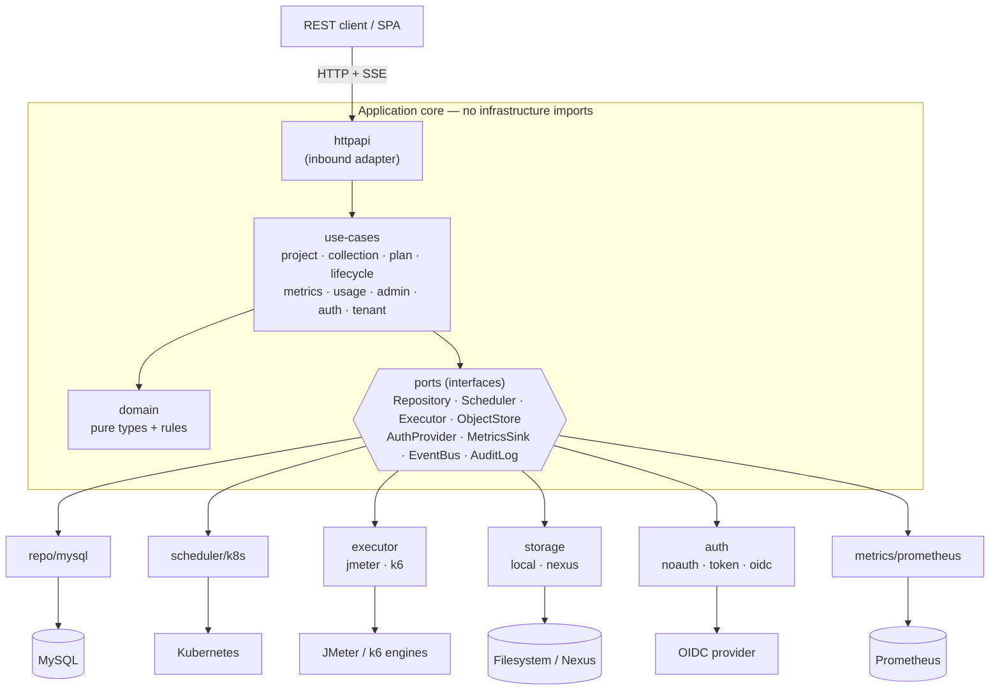
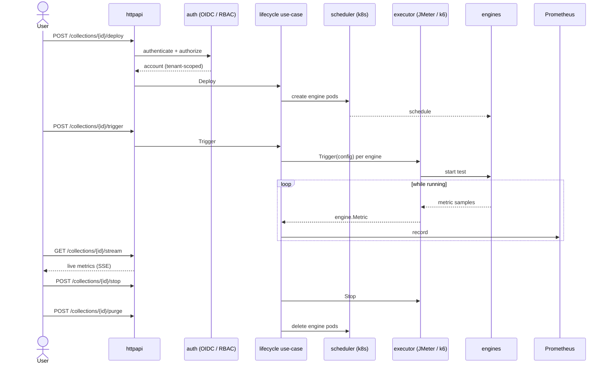

# Setagaya

[](https://github.com/heridotlife/Setagaya/actions/workflows/ci.yml)
[](https://github.com/heridotlife/Setagaya/actions/workflows/codeql.yml)
[](https://github.com/heridotlife/Setagaya/actions/workflows/security.yml)
[](https://goreportcard.com/report/github.com/heridotlife/Setagaya)
[](https://codecov.io/gh/heridotlife/Setagaya)
[](go.mod)
[](LICENSE)

Setagaya is a cloud-native, distributed load-testing platform written in Go. It
orchestrates load-generation engines (JMeter and k6) on Kubernetes, streams live
metrics to Prometheus, and exposes a REST API for managing projects, test plans,
and runs — with pluggable authentication, RBAC, and multi-tenancy.

The codebase is a test-driven, hexagonal (ports-and-adapters) implementation:
the domain is pure, use-cases depend on interfaces (ports), and every adapter is
validated by the same conformance suite as its in-memory fake. CI enforces a
**≥90%** coverage gate over production packages.

## Architecture

```
cmd/
  api/          REST API server (wires adapters -> app)
  controller/   orchestrator entrypoint
  agent/        engine-side metrics agent
internal/
  domain/       pure business types + rules, zero I/O imports
                (project, collection, plan, execution, run, engine,
                 usage, account, rbac, tenant)
  ports/        interfaces the app depends on
                (Repository, Scheduler, Executor, ObjectStore,
                 AuthProvider, MetricsSink, EventBus, AuditLog, ...)
    fake/       in-memory port implementations for fast tests
    *test/      reusable conformance suites run against every adapter
  app/          use-cases orchestrating the domain over ports
                (project, collection, plan, lifecycle, metrics, usage,
                 admin, auth, tenant)
  adapters/
    httpapi/          inbound REST adapter (net/http)
    repo/mysql/       MySQL repository adapter
    scheduler/k8s/    Kubernetes engine scheduler
    executor/jmeter/  JMeter executor
    executor/k6/      k6 executor
    storage/local/    filesystem object store
    storage/nexus/    Sonatype Nexus raw-repo object store
    auth/{noauth,token,oidc}/   authentication providers
    metrics/prometheus/         Prometheus metrics sink
    eventbus/memory/            in-process event bus
    audit/memory/               audit log
  config/       typed, injected configuration (no globals)
migrations/     embedded, ordered SQL migrations
test/
  dbtest/       testcontainers MySQL helper (integration/e2e only)
  e2e/          full-stack end-to-end tests
scripts/
  coverage.sh   coverage gate used by CI
```

### Component overview

Requests enter through the inbound HTTP adapter and flow into the pure
application core; the core reaches the outside world only through ports, each
backed by an interchangeable adapter (and an in-memory fake in tests).



**Principles**

- The domain imports no infrastructure; use-cases depend on ports, not adapters.
- Every port ships an in-memory fake. Real adapters must pass the *same*
  conformance suite as the fake (`internal/ports/*test`), keeping them
  interchangeable.
- Configuration and collaborators are injected — there is no global state.

## Test lifecycle

A load test moves through **deploy → trigger → stream → stop → purge**. Every
request is authenticated and (when RBAC is enabled) authorized against the
caller's tenant before the lifecycle use-case orchestrates the scheduler and
executor; metrics stream back live over SSE while the test runs.



## Testing

Three layers, gated in CI at **≥90%** coverage over production packages:

| Lane | Command | Needs Docker |
|------|---------|:---:|
| Unit | `make test` | no |
| Integration (adapter contract tests) | `make integration` | yes |
| End-to-end (real HTTP → services → MySQL) | `make e2e` | yes |
| Coverage gate (all of the above) | `make cover-gate` | yes |

Integration/e2e tests are guarded by the `integration` / `e2e` build tags, so
the default build and unit lane stay free of Docker dependencies.

## Run locally

```bash
# Walking skeleton against the in-memory repository:
go run ./cmd/api                 # serves :8080

curl localhost:8080/healthz      # {"status":"ok"}
curl localhost:8080/api/projects # []
curl localhost:8080/metrics      # Prometheus exposition
```

## Configuration

Configuration is read from `SETAGAYA_*` environment variables (see
`internal/config`); there are no config files or global singletons. Everything
has a local-dev default, so `go run ./cmd/api` works with no environment set.

| Variable | Default | Purpose |
|----------|---------|---------|
| `SETAGAYA_HTTP_PORT` | `8080` | API listen port |
| `SETAGAYA_DB_DRIVER` | `fake` | `fake` (in-memory) or `mysql` |
| `SETAGAYA_DB_DSN` | – | MySQL DSN (required when driver is `mysql`) |
| `SETAGAYA_STORAGE_DRIVER` | `local` | `local` or `nexus` |
| `SETAGAYA_STORAGE_ROOT` | `storage-data` | filesystem root (local store) |
| `SETAGAYA_STORAGE_BASE_URL` | – | retrieval base URL (local) / Nexus server URL |
| `SETAGAYA_NEXUS_REPO` | – | Nexus raw repository (required for `nexus`) |
| `SETAGAYA_NEXUS_USERNAME` / `_PASSWORD` | – | Nexus basic-auth credentials |
| `SETAGAYA_SCHEDULER` | `fake` | `fake` or `k8s` |
| `SETAGAYA_EXECUTOR` | `fake` | `fake`, `jmeter`, or `k6` |
| `SETAGAYA_ENGINE_IMAGE` | `setagaya/jmeter:latest` | engine container image |
| `SETAGAYA_AUTH_MODE` | `none` | `none` (fixed admin) or `oidc` |
| `SETAGAYA_ENABLE_RBAC` | `false` | enable tenant-scoped RBAC |
| `SETAGAYA_OIDC_ISSUER` / `_AUDIENCE` / `_JWKS_URL` | – | OIDC ID-token verification (required for `oidc`) |
| `SETAGAYA_MAX_ENGINES` | `500` | per-collection engine guardrail |
| `SETAGAYA_LOG_LEVEL` / `_FORMAT` | `info` / `json` | structured logging |

Run against MySQL with the JMeter executor on Kubernetes, for example:

```bash
SETAGAYA_DB_DRIVER=mysql SETAGAYA_DB_DSN='user:pw@tcp(db:3306)/setagaya' \
SETAGAYA_SCHEDULER=k8s SETAGAYA_EXECUTOR=jmeter \
SETAGAYA_AUTH_MODE=oidc SETAGAYA_ENABLE_RBAC=true \
SETAGAYA_OIDC_ISSUER=https://issuer.example \
SETAGAYA_OIDC_JWKS_URL=https://issuer.example/.well-known/jwks.json \
go run ./cmd/api
```

Migrations are embedded and applied automatically on startup when the MySQL
driver is selected.

## License

See [LICENSE](LICENSE).
