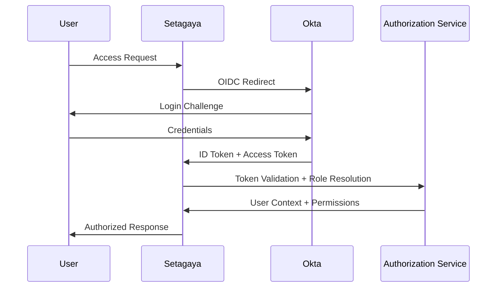

# Setagaya RBAC Development Plan
## Next Generation Role-Based Access Control with Okta Integration

**Version**: 1.0
**Date**: September 11, 2025
**Status**: Planning Phase

---

## Executive Summary

This document outlines the development plan for implementing a comprehensive Role-Based Access Control (RBAC) system in Setagaya with Okta integration. The new system will replace the current LDAP-based authentication with a modern, scalable, and secure identity management solution that supports multi-tenant environments and fine-grained permissions.

## Current State Analysis

### Existing Authentication Architecture
- **Current System**: LDAP-based authentication with simple group membership
- **Permission Model**: Binary ownership model (owner/admin access)
- **Session Management**: Cookie-based sessions with MySQL storage
- **Limitations**:
  - No role hierarchy or fine-grained permissions
  - Limited multi-tenant support
  - Manual user management
  - No audit trail for access decisions
  - Difficult to scale across multiple organizations

### Technical Debt
- Hardcoded admin user checks
- Simple group membership validation (`account.MLMap`)
- No separation between authentication and authorization
- Limited API security controls

---

## Target RBAC Model

### Role Hierarchy

#### 1. **Service Provider Roles**
```
├── Admin (Service Provider)
│   ├── Full platform administration
│   ├── Global configuration management
│   ├── User/tenant lifecycle management
│   ├── System monitoring and maintenance
│   └── Emergency incident response
│
└── Support (Service Provider)
    ├── User support and troubleshooting
    ├── Read-only access to tenant data
    ├── Log analysis and diagnostics
    ├── Performance monitoring
    └── Issue escalation capabilities
```

#### 2. **Project Management Roles**
```
└── PJM Loadtest (Project Manager)
    ├── Cross-tenant project oversight
    ├── Resource allocation and planning
    ├── Performance analytics and reporting
    ├── Best practice enforcement
    └── Strategic load testing guidance
```

#### 3. **Tenant Roles**
```
├── Tenant Admin
│   ├── Full tenant administration
│   ├── User management within tenant
│   ├── Project/collection lifecycle
│   ├── Resource quota management
│   └── Billing and usage monitoring
│
├── Tenant Editor
│   ├── Create/modify projects and collections
│   ├── Upload test plans and data
│   ├── Execute load tests
│   ├── View results and metrics
│   └── Manage owned resources
│
└── Tenant Viewer
    ├── Read-only access to tenant resources
    ├── View test results and dashboards
    ├── Download reports
    └── Monitor ongoing tests
```

### Permission Matrix

| Resource/Action | Admin | Support | PJM | T-Admin | T-Editor | T-Viewer |
|----------------|-------|---------|-----|---------|----------|----------|
| **Platform Management** |
| System Configuration | ✅ | ❌ | ❌ | ❌ | ❌ | ❌ |
| User Management | ✅ | 👁️ | ❌ | 🏠 | ❌ | ❌ |
| Tenant Management | ✅ | 👁️ | ❌ | ❌ | ❌ | ❌ |
| **Project Management** |
| Create Project | ✅ | ❌ | ✅ | ✅ | ✅ | ❌ |
| Delete Project | ✅ | ❌ | ✅ | ✅ | 🏠 | ❌ |
| Modify Project | ✅ | ❌ | ✅ | ✅ | 🏠 | ❌ |
| View Project | ✅ | ✅ | ✅ | ✅ | ✅ | ✅ |
| **Load Testing** |
| Execute Tests | ✅ | ❌ | ✅ | ✅ | ✅ | ❌ |
| Upload Test Plans | ✅ | ❌ | ✅ | ✅ | ✅ | ❌ |
| View Results | ✅ | ✅ | ✅ | ✅ | ✅ | ✅ |
| **Monitoring** |
| System Metrics | ✅ | ✅ | ✅ | 🏠 | 🏠 | 🏠 |
| Audit Logs | ✅ | ✅ | ❌ | 🏠 | ❌ | ❌ |

**Legend**: ✅ Full Access | 👁️ Read-Only | 🏠 Tenant-Scoped | ❌ No Access

---

## Okta Integration Architecture

### Authentication Flow


### Okta Configuration Requirements

#### Application Setup
- **Application Type**: Web Application
- **Grant Types**: Authorization Code, Refresh Token
- **Redirect URIs**: `https://setagaya.company.com/auth/callback`
- **Logout URIs**: `https://setagaya.company.com/auth/logout`

#### Group/Role Mapping
```json
{
  "okta_groups": {
    "setagaya-service-admin": "service_provider_admin",
    "setagaya-service-support": "service_provider_support",
    "setagaya-pjm-loadtest": "pjm_loadtest",
    "setagaya-tenant-{tenant_id}-admin": "tenant_admin",
    "setagaya-tenant-{tenant_id}-editor": "tenant_editor",
    "setagaya-tenant-{tenant_id}-viewer": "tenant_viewer"
  }
}
```

#### Custom Claims
- `setagaya_roles`: Array of assigned roles
- `tenant_memberships`: Array of tenant IDs user has access to
- `service_provider`: Boolean indicating service provider status

---

## Development Methodology

### Test-Driven Development (TDD) First Approach

The RBAC implementation will follow a strict TDD methodology to ensure reliability, maintainability, and comprehensive test coverage:

#### **Core TDD Principles**
- **Red-Green-Refactor Cycle**: Write failing tests first, implement minimal code to pass, then refactor
- **Test Coverage Target**: **80% minimum code coverage** across all RBAC components
- **API-First Design**: OpenAPI specification drives implementation and testing
- **Behavior-Driven Testing**: Focus on user scenarios and business requirements
- **Contract Testing**: Ensure API contracts are maintained across changes

#### **Testing Strategy Hierarchy**
1. **Unit Tests** (40% of total coverage)
   - Individual function and method testing
   - Permission logic validation
   - Role assignment algorithms
   - Token validation and parsing

2. **Integration Tests** (25% of total coverage)
   - Database interaction testing
   - Okta integration validation
   - RBAC engine integration
   - API endpoint authorization

3. **End-to-End Tests** (15% of total coverage)
   - Complete user journey testing
   - Multi-tenant workflow validation
   - Authentication flow testing
   - Cross-service integration

#### **API Documentation First**
- **OpenAPI 3.0 Specification**: Complete before implementation begins
- **Contract-Driven Development**: API contracts guide implementation
- **Mock Server Generation**: Enable parallel frontend/backend development
- **Automated Documentation**: Generated from OpenAPI spec with examples
- **Interactive Testing**: Swagger UI for manual API exploration

### Quality Assurance Standards

#### **Code Quality Metrics**
- **Test Coverage**: Minimum 80% for all RBAC modules
- **Code Complexity**: Maximum cyclomatic complexity of 10 per function
- **Security Scanning**: Zero critical/high vulnerabilities
- **Performance**: Sub-100ms authorization decisions
- **Documentation**: 100% API endpoint documentation coverage

#### **Continuous Integration Requirements**
- **All tests pass**: Unit, integration, and E2E tests must pass
- **Coverage gates**: Builds fail if coverage drops below 80%
- **Security gates**: Builds fail on security vulnerabilities
- **Lint checks**: Code formatting and style enforcement
- **Documentation validation**: OpenAPI spec validation and link checking

---

## Technical Implementation Plan

### Phase 1: API Design & Test Infrastructure (4 weeks)

#### 1.1 API-First Design (Week 1)
- [ ] **OpenAPI 3.0 Specification**: Complete RBAC API specification
  - Authentication endpoints (`/auth/login`, `/auth/callback`, `/auth/logout`)
  - User management (`/api/users`, `/api/users/{id}/roles`)
  - Role management (`/api/roles`, `/api/roles/{id}/permissions`)
  - Tenant management (`/api/tenants`, `/api/tenants/{id}/users`)
  - Authorization endpoints (`/api/auth/check`, `/api/auth/permissions`)
- [ ] **Mock Server Setup**: Generate mock API server from OpenAPI spec
- [ ] **Contract Testing Framework**: Set up API contract testing with Pact
- [ ] **API Documentation**: Interactive Swagger UI with examples

#### 1.2 Test Infrastructure Setup (Week 1)
- [ ] **Testing Framework**: Configure Go testing with testify and ginkgo
- [ ] **Test Database**: Containerized MySQL for integration tests
- [ ] **Mock Services**: Okta mock server for authentication testing
- [ ] **Coverage Tools**: Integrate gocov, go-test-coverage for 80% target
- [ ] **CI/CD Pipeline**: GitHub Actions with coverage gates and quality checks

#### 1.3 Core Domain Model Tests (Week 2)
- [ ] **Role Model Tests**: TDD for role creation, hierarchy, permissions
- [ ] **Tenant Model Tests**: TDD for tenant management and isolation
- [ ] **User Role Assignment Tests**: TDD for user-role-tenant relationships
- [ ] **Permission Logic Tests**: TDD for authorization decision engine
- [ ] **Audit Logging Tests**: TDD for comprehensive audit trail

#### 1.4 Okta Integration Tests (Week 2)
- [ ] **JWT Validation Tests**: Token parsing, signature verification, claims
- [ ] **OIDC Flow Tests**: Authorization code flow, token exchange
- [ ] **Group Mapping Tests**: Okta groups to Setagaya roles mapping
- [ ] **Session Management Tests**: Token refresh, logout, expiration
- [ ] **Error Handling Tests**: Invalid tokens, network failures, API errors

#### 1.5 Database Schema & Migration Tests (Week 3-4)
- [ ] **Schema Validation Tests**: Database constraint and relationship testing
- [ ] **Migration Tests**: Forward and backward migration validation
- [ ] **Data Integrity Tests**: Referential integrity and cascade operations
- [ ] **Performance Tests**: Query performance under load
- [ ] **Backup/Restore Tests**: Data migration and recovery procedures

#### 1.2 Database Schema Updates
```sql
-- New RBAC tables
CREATE TABLE roles (
    id BIGINT PRIMARY KEY AUTO_INCREMENT,
    name VARCHAR(100) NOT NULL UNIQUE,
    description TEXT,
    permissions JSON,
    created_at TIMESTAMP DEFAULT CURRENT_TIMESTAMP,
    updated_at TIMESTAMP DEFAULT CURRENT_TIMESTAMP ON UPDATE CURRENT_TIMESTAMP
);

CREATE TABLE tenants (
    id BIGINT PRIMARY KEY AUTO_INCREMENT,
    name VARCHAR(255) NOT NULL,
    okta_group_prefix VARCHAR(100) NOT NULL,
    quota_config JSON,
    billing_config JSON,
    created_at TIMESTAMP DEFAULT CURRENT_TIMESTAMP,
    updated_at TIMESTAMP DEFAULT CURRENT_TIMESTAMP ON UPDATE CURRENT_TIMESTAMP
);

CREATE TABLE user_roles (
    id BIGINT PRIMARY KEY AUTO_INCREMENT,
    user_id VARCHAR(255) NOT NULL, -- Okta user ID
    role_id BIGINT NOT NULL,
    tenant_id BIGINT NULL, -- NULL for global roles
    granted_at TIMESTAMP DEFAULT CURRENT_TIMESTAMP,
    granted_by VARCHAR(255),
    FOREIGN KEY (role_id) REFERENCES roles(id),
    FOREIGN KEY (tenant_id) REFERENCES tenants(id),
    UNIQUE KEY unique_user_role_tenant (user_id, role_id, tenant_id)
);

CREATE TABLE audit_log (
    id BIGINT PRIMARY KEY AUTO_INCREMENT,
    user_id VARCHAR(255) NOT NULL,
    action VARCHAR(100) NOT NULL,
    resource_type VARCHAR(50) NOT NULL,
    resource_id VARCHAR(100),
    tenant_id BIGINT NULL,
    result ENUM('ALLOWED', 'DENIED') NOT NULL,
    reason TEXT,
    timestamp TIMESTAMP DEFAULT CURRENT_TIMESTAMP,
    FOREIGN KEY (tenant_id) REFERENCES tenants(id)
);
```

#### 1.3 Configuration Updates
```go
type OktaConfig struct {
    Domain       string `json:"domain"`
    ClientID     string `json:"client_id"`
    ClientSecret string `json:"client_secret"`
    RedirectURI  string `json:"redirect_uri"`
    Scopes       []string `json:"scopes"`
}

type RBACConfig struct {
    EnableRBAC        bool         `json:"enable_rbac"`
    DefaultTenantRole string       `json:"default_tenant_role"`
    SessionTimeout    int          `json:"session_timeout_minutes"`
    AuditEnabled      bool         `json:"audit_enabled"`
    Okta              *OktaConfig  `json:"okta"`
}
```

### Phase 2: RBAC Engine Development (3 weeks)

#### 2.1 Permission Framework TDD (Week 1)
- [ ] **Permission Model Tests**: Define and test permission structures
- [ ] **Role Hierarchy Tests**: Test role inheritance and permission aggregation
- [ ] **Authorization Algorithm Tests**: Test decision logic with edge cases
- [ ] **Resource Authorization Tests**: Test resource-specific permission checks
- [ ] **Performance Benchmark Tests**: Sub-100ms authorization decision targets

#### 2.2 Authorization Engine Implementation (Week 1-2)
- [ ] **Implement Permission Checker**: Based on failing tests from 2.1
- [ ] **Role Assignment Engine**: User-role-tenant relationship management
- [ ] **Permission Cache Layer**: Redis-based caching with TTL management
- [ ] **Authorization Middleware**: HTTP middleware for API protection
- [ ] **Context Propagation**: User context through request lifecycle

#### 2.3 Integration Testing (Week 2-3)
- [ ] **Database Integration Tests**: RBAC engine with MySQL backend
- [ ] **Cache Integration Tests**: Redis cache with fallback mechanisms
- [ ] **API Integration Tests**: Authorization middleware with mock APIs
- [ ] **Cross-Service Tests**: RBAC engine with existing Setagaya services
- [ ] **Load Testing**: Performance validation under concurrent load

#### 2.4 Security Testing (Week 3)
- [ ] **Privilege Escalation Tests**: Ensure no unauthorized access paths
- [ ] **Token Security Tests**: JWT handling, validation, and security
- [ ] **SQL Injection Tests**: Database query security validation
- [ ] **Authorization Bypass Tests**: Edge cases and boundary testing
- [ ] **Audit Trail Validation**: Comprehensive logging verification

### Phase 3: Multi-Tenant Architecture (3 weeks)

#### 3.1 Tenant Management API Testing (Week 1)
- [ ] **Tenant CRUD Tests**: Create, read, update, delete tenant operations
- [ ] **Tenant Isolation Tests**: Ensure complete data separation between tenants
- [ ] **User-Tenant Association Tests**: User membership and role assignment testing
- [ ] **Quota Management Tests**: Resource limits and usage tracking validation
- [ ] **Tenant Configuration Tests**: Custom settings and metadata management

#### 3.2 Data Isolation Implementation (Week 1-2)
- [ ] **Database Migration Tests**: Add tenant_id columns with validation
- [ ] **Query Scoping Tests**: Ensure all queries include tenant context
- [ ] **Cross-Tenant Access Tests**: Verify no unauthorized cross-tenant access
- [ ] **Data Migration Tests**: Existing data assignment to default tenant
- [ ] **Backup/Restore Tests**: Tenant-specific data operations

#### 3.3 Resource Scoping Testing (Week 2)
- [ ] **Project Scoping Tests**: Projects isolated by tenant
- [ ] **Collection Scoping Tests**: Collections within tenant boundaries
- [ ] **Plan Scoping Tests**: Test plans scoped to tenant context
- [ ] **Execution Scoping Tests**: Load test execution within tenant limits
- [ ] **Metrics Scoping Tests**: Monitoring data isolated by tenant

#### 3.4 Quota & Billing Integration (Week 2-3)
- [ ] **Resource Quota Tests**: Limits on projects, collections, engines
- [ ] **Usage Tracking Tests**: Monitor resource consumption per tenant
- [ ] **Quota Enforcement Tests**: Prevent exceeding tenant limits
- [ ] **Billing Integration Tests**: Usage data for billing systems
- [ ] **Alert System Tests**: Notifications for quota approaching limits

#### 3.5 Kubernetes Multi-Tenancy (Week 3)
- [ ] **Namespace Strategy Tests**: Tenant-specific Kubernetes namespaces
- [ ] **Resource Isolation Tests**: CPU/memory limits per tenant
- [ ] **Network Policy Tests**: Network isolation between tenants
- [ ] **Storage Isolation Tests**: Persistent volume tenant separation
- [ ] **Security Context Tests**: Pod security policies per tenant

### Phase 4: API Security Enhancement (2 weeks)

#### 4.1 Endpoint Protection Testing (Week 1)
- [ ] **Authorization Middleware Tests**: Comprehensive endpoint protection validation
- [ ] **Permission Matrix Tests**: Verify role-based access to all API endpoints
- [ ] **Resource-Specific Tests**: Fine-grained permission checking per resource
- [ ] **Error Handling Tests**: Consistent error responses for authorization failures
- [ ] **Rate Limiting Tests**: API rate limiting by user and tenant

#### 4.2 Security Hardening Implementation (Week 1-2)
- [ ] **JWT Security Tests**: Token validation, expiration, and refresh testing
- [ ] **Input Validation Tests**: SQL injection and XSS prevention validation
- [ ] **CORS Policy Tests**: Cross-origin request security validation
- [ ] **Security Headers Tests**: HTTPS, HSTS, CSP header validation
- [ ] **Session Security Tests**: Secure session management and timeout

#### 4.3 API Contract Validation (Week 2)
- [ ] **OpenAPI Compliance Tests**: Ensure implementation matches specification
- [ ] **Response Schema Tests**: Validate all API responses against schemas
- [ ] **Request Validation Tests**: Input validation according to API contracts
- [ ] **Version Compatibility Tests**: Backward compatibility for API changes
- [ ] **Error Response Tests**: Standardized error format validation

#### 4.4 Performance & Load Testing (Week 2)
- [ ] **Authorization Performance Tests**: Sub-100ms response time validation
- [ ] **Concurrent User Tests**: Multiple users accessing APIs simultaneously
- [ ] **Database Load Tests**: Query performance under high load
- [ ] **Cache Performance Tests**: Permission cache hit rates and performance
- [ ] **Stress Testing**: System behavior under extreme load conditions

### Phase 5: Monitoring, Audit & Compliance (2 weeks)

#### 5.1 Audit System Testing (Week 1)
- [ ] **Audit Trail Tests**: Comprehensive logging of all authorization decisions
- [ ] **Immutable Log Tests**: Ensure audit logs cannot be modified or deleted
- [ ] **Log Retention Tests**: Automated cleanup and archival policies
- [ ] **Search & Filter Tests**: Audit log querying and analysis capabilities
- [ ] **Export/Import Tests**: Audit data export for compliance systems

#### 5.2 Monitoring & Metrics Testing (Week 1)
- [ ] **Prometheus Metrics Tests**: RBAC-specific metrics collection and validation
- [ ] **Grafana Dashboard Tests**: Real-time monitoring dashboard functionality
- [ ] **Alert System Tests**: Automated alerts for security and performance issues
- [ ] **Health Check Tests**: System health monitoring and status reporting
- [ ] **Performance Metrics Tests**: Response time, throughput, and error rate tracking

#### 5.3 Compliance Validation (Week 2)
- [ ] **SOC2 Compliance Tests**: Control testing for security certification
- [ ] **GDPR Compliance Tests**: Data protection and privacy validation
- [ ] **Access Review Tests**: Periodic access reviews and certification
- [ ] **Privileged Access Tests**: Administrative access monitoring and controls
- [ ] **Incident Response Tests**: Security incident detection and response

#### 5.4 End-to-End System Testing (Week 2)
- [ ] **User Journey Tests**: Complete workflows from login to task completion
- [ ] **Cross-Tenant Isolation Tests**: Final validation of tenant separation
- [ ] **Disaster Recovery Tests**: Backup, restore, and failover procedures
- [ ] **Performance Regression Tests**: Ensure no performance degradation
- [ ] **Security Penetration Tests**: Final security validation and assessment

#### 5.5 Documentation & Training (Week 2)
- [ ] **API Documentation Tests**: Validate all endpoints are documented
- [ ] **User Guide Tests**: Validate documentation accuracy with real workflows
- [ ] **Training Material Tests**: Validate admin and user training content
- [ ] **Troubleshooting Guide Tests**: Common issues and resolution procedures
- [ ] **Migration Guide Tests**: Step-by-step migration documentation validation

---

## Migration Strategy

### Phase 1: Parallel Authentication
1. Deploy new Okta authentication alongside existing LDAP
2. Add feature flag for authentication method
3. Test Okta integration with service provider accounts
4. Validate token handling and session management

### Phase 2: Role Migration
1. Create role definitions in new system
2. Map existing LDAP groups to new roles
3. Import user-role relationships
4. Validate permission mappings

### Phase 3: Gradual Rollout
1. Enable RBAC for new tenants first
2. Migrate existing projects to tenant model
3. Update API consumers to handle new permission model
4. Deprecate legacy authentication endpoints

### Phase 4: Legacy Cleanup
1. Remove LDAP authentication code
2. Clean up old permission checking logic
3. Update documentation and API specifications
4. Archive migration tools

---

## Risk Assessment & Mitigation

### High-Risk Items
| Risk | Impact | Probability | Mitigation |
|------|--------|-------------|------------|
| **Data Loss During Migration** | High | Low | Comprehensive backup strategy, gradual rollout |
| **Authentication Outage** | High | Medium | Parallel system deployment, rollback procedures |
| **Permission Escalation** | High | Low | Thorough testing, security review, audit logging |
| **Performance Degradation** | Medium | Medium | Load testing, caching strategy, DB optimization |

### Security Considerations
- **Token Security**: Implement proper JWT validation and refresh token rotation
- **Session Management**: Secure session storage and timeout policies
- **API Security**: Rate limiting, input validation, and CORS policies
- **Audit Trail**: Immutable audit logs for compliance and security monitoring

---

## Success Metrics

### Technical Metrics
- **Authentication Latency**: < 200ms for token validation
- **Authorization Performance**: < 50ms for permission checks
- **System Availability**: 99.9% uptime during migration
- **Security Coverage**: 100% of API endpoints protected

### Business Metrics
- **User Experience**: Seamless SSO integration
- **Administrative Efficiency**: 50% reduction in user management overhead
- **Compliance**: Full audit trail for security reviews
- **Scalability**: Support for 10x current user base

---

## Timeline & Milestones

### Q4 2025 (Development Phase)
- **Week 1-4**: Okta integration and authentication infrastructure
- **Week 5-7**: Authorization engine and middleware
- **Week 8-10**: Multi-tenant support and quota management
- **Week 11-12**: API security enhancement
- **Week 13-14**: Monitoring, audit, and testing

### Q1 2026 (Deployment Phase)
- **Month 1**: Staging deployment and service provider testing
- **Month 2**: Pilot tenant onboarding and validation
- **Month 3**: Production rollout and legacy migration

### Q2 2026 (Optimization Phase)
- **Month 1**: Performance optimization and monitoring
- **Month 2**: Feature enhancement based on user feedback
- **Month 3**: Legacy system deprecation and cleanup

---

## Dependencies & Prerequisites

### External Dependencies
- **Okta Subscription**: Enterprise-level subscription with custom claims
- **Infrastructure**: Additional database capacity for audit logs
- **Compliance**: Security review and approval process

### Internal Dependencies
- **DevOps**: CI/CD pipeline updates for new authentication flow
- **Security Team**: Security architecture review and penetration testing
- **Product Team**: User experience validation and training materials

---

## Conclusion

This RBAC development plan provides a comprehensive roadmap for transforming Setagaya into a modern, secure, multi-tenant load testing platform. The Okta integration will provide enterprise-grade identity management while the new authorization system will enable fine-grained access control and comprehensive audit capabilities.

The phased approach ensures minimal risk to existing operations while delivering immediate value through improved security and user management capabilities. Success will be measured through technical performance metrics, security improvements, and enhanced user experience.

---

**Next Steps:**
1. Review and approve this development plan
2. Allocate development resources and timeline
3. Set up Okta development environment
4. Begin Phase 1 implementation
5. Establish security review process

**Document Owner**: Development Team
**Review Cycle**: Monthly during development, quarterly post-deployment
**Last Updated**: September 11, 2025
