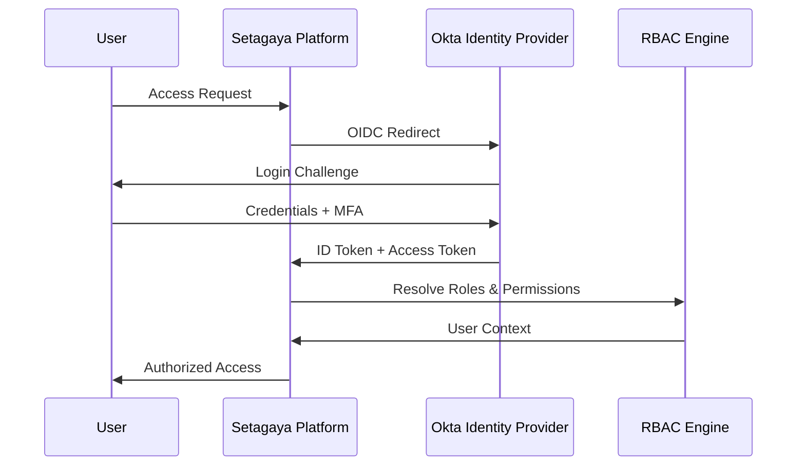

# Setagaya v3.0 Enterprise RBAC Initiative
## Executive Summary & Implementation Overview

**Initiative**: Enterprise Role-Based Access Control with Okta Integration
**Target Release**: v3.0.0 (Q2 2026)
**Strategic Value**: Multi-tenant SaaS transformation with enterprise identity management

---

## 🎯 Business Objectives

### Primary Goals
1. **Enterprise Readiness**: Transform Setagaya into a multi-tenant SaaS platform
2. **Security Enhancement**: Implement enterprise-grade identity and access management
3. **Operational Efficiency**: Reduce user management overhead by 50%
4. **Compliance**: Meet SOC2, PCI-DSS, and GDPR requirements
5. **Scalability**: Support 10x current user base with tenant isolation

### Success Metrics
- **Authentication Latency**: < 200ms for token validation
- **User Management**: 80% reduction in manual user provisioning
- **Security Incidents**: Zero privilege escalation vulnerabilities
- **Customer Satisfaction**: 95% satisfaction with SSO experience
- **Revenue Impact**: Enable enterprise customer acquisition

---

## 🏢 Role-Based Access Control Model

### Stakeholder Roles

#### **Service Provider** (Platform Operations)
```
┌─ Admin ─────────────────────────────────────┐
│ • Global platform administration           │
│ • Tenant lifecycle management              │
│ • System configuration and maintenance     │
│ • Emergency incident response              │
│ • Billing and compliance oversight         │
└─────────────────────────────────────────────┘

┌─ Support ───────────────────────────────────┐
│ • Customer support and troubleshooting     │
│ • Read-only access to tenant data          │
│ • Log analysis and diagnostics             │
│ • Performance monitoring and optimization  │
│ • Issue escalation and documentation       │
└─────────────────────────────────────────────┘
```

#### **Project Management** (Cross-Tenant Oversight)
```
┌─ PJM Loadtest ──────────────────────────────┐
│ • Cross-tenant project coordination        │
│ • Resource allocation and planning         │
│ • Performance analytics and reporting      │
│ • Best practice enforcement                │
│ • Strategic load testing guidance          │
└─────────────────────────────────────────────┘
```

#### **Tenant Roles** (Customer Organization)
```
┌─ Tenant Admin ──────────────────────────────┐
│ • Full tenant administration rights        │
│ • User management within tenant            │
│ • Resource quota and billing management    │
│ • Project lifecycle oversight              │
│ • Integration and configuration            │
└─────────────────────────────────────────────┘

┌─ Tenant Editor ─────────────────────────────┐
│ • Create and modify projects/collections   │
│ • Upload test plans and data files         │
│ • Execute load tests and monitor results   │
│ • Manage owned resources                   │
│ • Collaborate within tenant                │
└─────────────────────────────────────────────┘

┌─ Tenant Viewer ─────────────────────────────┐
│ • Read-only access to tenant resources     │
│ • View test results and dashboards         │
│ • Download reports and analytics           │
│ • Monitor ongoing test executions          │
│ • Access shared documentation              │
└─────────────────────────────────────────────┘
```

---

## 🔐 Okta Integration Architecture

### Authentication Flow


### Identity Mapping Strategy
- **Okta Groups** → **Setagaya Roles**: Automated role assignment
- **Custom Claims**: Tenant memberships, service provider status
- **Just-in-Time Provisioning**: Automatic user creation on first login
- **Group Inheritance**: Hierarchical role assignment via Okta groups

---

## 📋 Implementation Phases

### **Phase 1: Authentication Infrastructure** (4 weeks)
**Deliverables**:
- [ ] Okta OIDC integration with JWT validation
- [ ] Session management and token refresh
- [ ] Database schema for RBAC entities
- [ ] Configuration management updates
- [ ] Basic authentication middleware

**Key Components**:
- Okta Go SDK integration
- JWT token validation middleware
- RBAC database tables (roles, tenants, user_roles, audit_log)
- Authentication configuration management

### **Phase 2: Authorization Engine** (3 weeks)
**Deliverables**:
- [ ] Permission framework and engine
- [ ] Resource-based authorization
- [ ] Role hierarchy implementation
- [ ] Permission caching system
- [ ] Authorization middleware

**Key Components**:
- RBAC permission engine
- Resource authorizers (Project, Collection, Plan)
- Permission caching with Redis
- Comprehensive authorization middleware

### **Phase 3: Multi-Tenant Support** (3 weeks)
**Deliverables**:
- [ ] Tenant management APIs
- [ ] Resource scoping implementation
- [ ] Quota management system
- [ ] Data isolation validation
- [ ] Tenant-scoped queries

**Key Components**:
- Tenant CRUD operations
- Resource scoping (tenant_id columns)
- Quota enforcement
- Kubernetes namespace strategy

### **Phase 4: API Security Enhancement** (2 weeks)
**Deliverables**:
- [ ] All endpoints protected with RBAC
- [ ] Resource-specific permissions
- [ ] Enhanced error handling
- [ ] API rate limiting
- [ ] Security headers

**Key Components**:
- Complete API endpoint protection
- Fine-grained permission checks
- Security middleware stack
- Error response standardization

### **Phase 5: Monitoring & Audit** (2 weeks)
**Deliverables**:
- [ ] Comprehensive audit logging
- [ ] RBAC metrics and monitoring
- [ ] Security dashboards
- [ ] Compliance reporting
- [ ] Alert configuration

**Key Components**:
- Immutable audit trail
- Prometheus RBAC metrics
- Grafana security dashboards
- Automated compliance reports

---

## 🎯 Technical Specifications

### Core Technologies
- **Identity Provider**: Okta (OIDC/OAuth2)
- **Authorization**: Custom RBAC engine
- **Token Format**: JWT with custom claims
- **Session Management**: Redis-backed sessions
- **Database**: MySQL with RBAC schema extension
- **Caching**: Redis for permission caching
- **Audit**: Structured logging with retention policies

### Security Standards
- **Authentication**: Multi-factor authentication (MFA) required
- **Token Security**: Short-lived tokens with refresh rotation
- **Data Encryption**: TLS 1.3 in transit, AES-256 at rest
- **Audit Compliance**: Immutable logs, 7-year retention
- **Zero Trust**: Verify every request, trust nothing

### Performance Requirements
- **Authentication**: < 200ms token validation
- **Authorization**: < 50ms permission checks
- **Scalability**: 10,000+ concurrent users
- **Availability**: 99.9% uptime SLA
- **Cache Hit Rate**: > 95% for permission checks

---

## 📊 Migration Strategy

### **Phase A: Parallel Systems** (Month 1)
- Deploy Okta authentication alongside existing LDAP
- Feature flag controlled authentication selection
- Service provider team testing and validation
- Performance benchmarking and optimization

### **Phase B: Role Migration** (Month 2)
- Map existing LDAP groups to new role structure
- Create tenant entities for existing organizations
- Import user-role relationships with validation
- Pilot tenant onboarding with select customers

### **Phase C: Production Rollout** (Month 3)
- Gradual migration of existing users to Okta
- Deprecation of LDAP authentication endpoints
- Full audit trail activation and monitoring
- Legacy system cleanup and documentation

### **Risk Mitigation**
- **Rollback Procedures**: Immediate fallback to LDAP if needed
- **Data Backup**: Complete backup before each migration phase
- **Monitoring**: Real-time authentication and authorization metrics
- **Support**: Dedicated support team during migration period

---

## 💼 Business Impact

### **Revenue Enablement**
- **Enterprise Sales**: Meet enterprise customer identity requirements
- **SaaS Transformation**: Enable multi-tenant pricing models
- **Market Expansion**: Access regulated industries requiring compliance
- **Competitive Advantage**: Modern identity management vs. legacy competitors

### **Operational Benefits**
- **Support Reduction**: Self-service user management via Okta
- **Security Posture**: Reduced attack surface and audit capabilities
- **Compliance**: Automated compliance reporting and evidence collection
- **Developer Productivity**: Modern authentication flows and APIs

### **Customer Value**
- **Single Sign-On**: Seamless integration with existing identity systems
- **Team Management**: Simplified user onboarding and role assignment
- **Security**: Enterprise-grade access controls and audit trails
- **Scalability**: Support for large organizations with complex hierarchies

---

## 📈 Success Criteria

### **Technical Metrics**
- ✅ **Zero** authentication-related security incidents
- ✅ **< 200ms** average authentication response time
- ✅ **99.9%** authentication service availability
- ✅ **100%** API endpoint RBAC coverage
- ✅ **< 50ms** authorization decision latency

### **Business Metrics**
- ✅ **50%** reduction in user management support tickets
- ✅ **95%** customer satisfaction with SSO experience
- ✅ **100%** enterprise customer identity requirements met
- ✅ **80%** faster new customer onboarding
- ✅ **Zero** compliance audit findings

### **Compliance Metrics**
- ✅ **100%** audit trail coverage for access decisions
- ✅ **SOC2 Type II** compliance certification ready
- ✅ **GDPR** data protection compliance
- ✅ **Zero** privilege escalation vulnerabilities
- ✅ **7-year** audit log retention capability

---

## 📚 Related Documentation

### **Planning & Strategy**
- **[RBAC Development Plan](RBAC_DEVELOPMENT_PLAN.md)** - Complete development strategy and timeline
- **[RBAC Technical Specification](RBAC_TECHNICAL_SPECIFICATION.md)** - Detailed implementation guidance
- **[Current Technical Specifications](../TECHNICAL_SPECS.md)** - Existing platform architecture

### **Security & Compliance**
- **[Security Policy](../SECURITY.md)** - Platform security measures and disclosure
- **[Security Checklist](../.github/SECURITY_CHECKLIST.md)** - Release security validation
- **[Development Guidelines](../.github/instructions/copilot.instructions.md)** - Security coding standards

### **API & Integration**
- **[OpenAPI Specification](api/openapi.yaml)** - Current REST API documentation
- **[JMeter Build Options](../setagaya/JMETER_BUILD_OPTIONS.md)** - Engine compatibility guide

---

## 🚀 Next Steps

### **Immediate Actions** (Next 2 Weeks)
1. **Stakeholder Approval**: Review and approve development plan
2. **Resource Allocation**: Assign development team and timeline
3. **Okta Environment**: Set up development Okta tenant
4. **Security Review**: Initial security architecture assessment

### **Development Kickoff** (Week 3)
1. **Sprint Planning**: Break down Phase 1 into sprint backlog
2. **Infrastructure Setup**: Development environment preparation
3. **Team Onboarding**: Development team Okta and RBAC training
4. **Baseline Metrics**: Establish current performance benchmarks

### **Ongoing Activities**
1. **Weekly Stakeholder Updates**: Progress reports and risk assessment
2. **Security Reviews**: Regular security architecture and code reviews
3. **Customer Communication**: Early adopter program and feedback collection
4. **Documentation**: Continuous update of technical and user documentation

---

**For questions or additional information, please refer to the detailed planning documents or contact the development team.**

**Document Revision**: 1.0 | **Last Updated**: September 11, 2025
