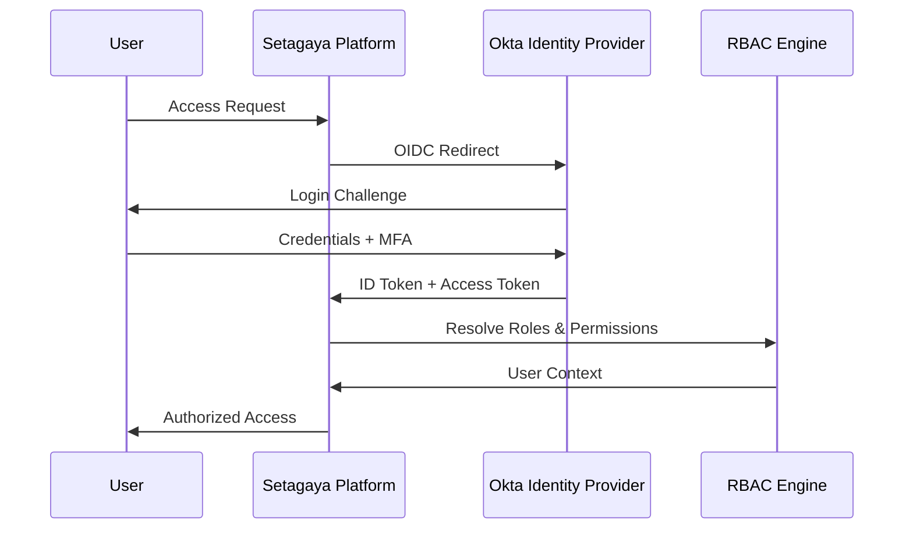

# Setagaya v2.0.0-rc.1 Enterprise RBAC Initiative
## Executive Summary & Implementation Overview

**Initiative**: Enterprise Role-Based Access Control with Okta Integration
**Target Release**: v2.0.0-rc.1 (December 2025)
**Strategic Value**: Multi-tenant SaaS transformation with enterprise identity management

---

## 🎯 Business Objectives

### Primary Goals
1. **Enterprise Readiness**: Transform Setagaya into a multi-tenant SaaS platform
2. **Security Enhancement**: Implement enterprise-grade identity and access management
3. **Operational Efficiency**: Reduce user management overhead by 50%
4. **Compliance**: Meet SOC2, PCI-DSS, and GDPR requirements
5. **Scalability**: Support 10x current user base with tenant isolation

### Success Metrics
- **Authentication Latency**: < 200ms for token validation
- **User Management**: 80% reduction in manual user provisioning
- **Security Incidents**: Zero privilege escalation vulnerabilities
- **Customer Satisfaction**: 95% satisfaction with SSO experience
- **Revenue Impact**: Enable enterprise customer acquisition

---

## 🏢 Role-Based Access Control Model

### Stakeholder Roles

#### **Service Provider** (Platform Operations)
```
┌─ Admin ─────────────────────────────────────┐
│ • Global platform administration           │
│ • Tenant lifecycle management              │
│ • System configuration and maintenance     │
│ • Emergency incident response              │
│ • Billing and compliance oversight         │
└─────────────────────────────────────────────┘

┌─ Support ───────────────────────────────────┐
│ • Customer support and troubleshooting     │
│ • Read-only access to tenant data          │
│ • Log analysis and diagnostics             │
│ • Performance monitoring and optimization  │
│ • Issue escalation and documentation       │
└─────────────────────────────────────────────┘
```

#### **Project Management** (Cross-Tenant Oversight)
```
┌─ PJM Loadtest ──────────────────────────────┐
│ • Cross-tenant project coordination        │
│ • Resource allocation and planning         │
│ • Performance analytics and reporting      │
│ • Best practice enforcement                │
│ • Strategic load testing guidance          │
└─────────────────────────────────────────────┘
```

#### **Tenant Roles** (Customer Organization)
```
┌─ Tenant Admin ──────────────────────────────┐
│ • Full tenant administration rights        │
│ • User management within tenant            │
│ • Resource quota and billing management    │
│ • Project lifecycle oversight              │
│ • Integration and configuration            │
└─────────────────────────────────────────────┘

┌─ Tenant Editor ─────────────────────────────┐
│ • Create and modify projects/collections   │
│ • Upload test plans and data files         │
│ • Execute load tests and monitor results   │
│ • Manage owned resources                   │
│ • Collaborate within tenant                │
└─────────────────────────────────────────────┘

┌─ Tenant Viewer ─────────────────────────────┐
│ • Read-only access to tenant resources     │
│ • View test results and dashboards         │
│ • Download reports and analytics           │
│ • Monitor ongoing test executions          │
│ • Access shared documentation              │
└─────────────────────────────────────────────┘
```

---

## 🔐 Okta Integration Architecture

### Authentication Flow


### Identity Mapping Strategy
- **Okta Groups** → **Setagaya Roles**: Automated role assignment
- **Custom Claims**: Tenant memberships, service provider status
- **Just-in-Time Provisioning**: Automatic user creation on first login
- **Group Inheritance**: Hierarchical role assignment via Okta groups

---

## 📋 Implementation Phases

### **Phase 1: Foundation & Database Schema** (2 weeks) ✅ **COMPLETED**
**Deliverables**:
- [x] RBAC database schema deployment (2025091101_rbac_initial_schema.sql)
- [x] Core RBAC interfaces and types definition
- [x] Database tables for roles, tenants, user_roles, audit_log
- [x] Migration support for existing tables (project, collection, plan)
- [x] Default roles and tenant creation

**Key Components**:
- Complete RBAC database schema with MySQL implementation
- Comprehensive interfaces (RBACEngine, ResourceAuthorizer, TenantRepository)
- Core RBAC types (Role, Tenant, UserRole, UserContext)
- Default system roles (service_provider_admin, tenant_admin, tenant_editor, tenant_viewer)

### **Phase 2: Core RBAC Engine** (3 weeks) ✅ **COMPLETED**
**Deliverables**:
- [x] Memory-based RBAC engine implementation
- [x] Permission framework and authorization logic
- [x] Role hierarchy and permission definitions
- [x] User context management
- [x] Basic audit logging framework

**Key Components**:
- MemoryRBACEngine with full interface implementation
- Permission checking with scope-based authorization (global, tenant, resource)
- Role-based permission inheritance
- In-memory audit log implementation
- User context with tenant access mapping

### **Phase 3: API Integration** (2 weeks) ✅ **COMPLETED**
**Deliverables**:
- [x] RBAC integration layer (rbac.Integration)
- [x] API server RBAC initialization
- [x] Legacy compatibility with LDAP fallback
- [x] Enhanced ownership validation
- [x] RBAC middleware framework

**Key Components**:
- Complete RBAC integration in API server (setagaya/api/main.go)
- Backward compatibility with existing LDAP authentication
- Runtime RBAC enablement with legacy fallback
- Enhanced ownership checking (HasProjectOwnership, HasCollectionOwnership)

### **Phase 4: Okta Integration Infrastructure** (3 weeks) 🔄 **IN PROGRESS**
**Deliverables**:
- [x] Okta provider interface and configuration
- [ ] JWT token validation implementation
- [ ] OIDC authentication flow
- [ ] Just-in-time user provisioning
- [ ] Okta group mapping to Setagaya roles

**Key Components**:
- OktaProvider interface with authentication methods
- OktaClaims structure for JWT token parsing
- Okta configuration management
- Group-based role assignment logic

### **Phase 5: Production Database Implementation** (2 weeks) 📋 **PLANNED**
**Deliverables**:
- [ ] Replace memory engine with MySQL implementation
- [ ] Database repository implementations
- [ ] Connection pooling and optimization
- [ ] Migration scripts and data validation
- [ ] Performance testing and benchmarking

**Key Components**:
- MySQL-based repository implementations (TenantRepository, RoleRepository, UserRoleRepository)
- Database connection management
- Query optimization and indexing
- Data migration from legacy LDAP groups

### **Phase 6: API Security Enhancement** (2 weeks) 📋 **PLANNED**
**Deliverables**:
- [ ] Complete API endpoint RBAC protection
- [ ] Resource-specific permission middleware
- [ ] Enhanced error handling and responses
- [ ] API rate limiting implementation
- [ ] Security headers and CORS configuration

**Key Components**:
- Per-endpoint permission requirements
- Resource-specific authorization checks
- Standardized error response format
- Rate limiting per user/tenant
- Security middleware stack

### **Phase 7: Monitoring & Compliance** (2 weeks) 📋 **PLANNED**
**Deliverables**:
- [ ] Production audit logging to database
- [ ] RBAC metrics and monitoring
- [ ] Security dashboards
- [ ] Compliance reporting
- [ ] Alert configuration

**Key Components**:
- Persistent audit trail with retention policies
- Prometheus RBAC metrics
- Grafana security dashboards
- Automated compliance reports

---

## 🎯 Technical Specifications

### Core Technologies
- **Identity Provider**: Okta (OIDC/OAuth2)
- **Authorization**: Custom RBAC engine
- **Token Format**: JWT with custom claims
- **Session Management**: Redis-backed sessions
- **Database**: MySQL with RBAC schema extension
- **Caching**: Redis for permission caching
- **Audit**: Structured logging with retention policies

### Security Standards
- **Authentication**: Multi-factor authentication (MFA) required
- **Token Security**: Short-lived tokens with refresh rotation
- **Data Encryption**: TLS 1.3 in transit, AES-256 at rest
- **Audit Compliance**: Immutable logs, 7-year retention
- **Zero Trust**: Verify every request, trust nothing

### Performance Requirements
- **Authentication**: < 200ms token validation
- **Authorization**: < 50ms permission checks
- **Scalability**: 10,000+ concurrent users
- **Availability**: 99.9% uptime SLA
- **Cache Hit Rate**: > 95% for permission checks

---

## 📊 Migration Strategy

### **Phase A: Foundation Deployment** (Month 1) ✅ **COMPLETED**
- ✅ RBAC database schema deployed with default data
- ✅ Core RBAC engine implementation completed
- ✅ API integration with legacy fallback enabled
- ✅ Memory-based implementation for development testing
- ✅ Database migration scripts for existing data

### **Phase B: Okta Integration** (Month 2) 🔄 **IN PROGRESS**
- 🔄 Okta provider implementation and testing
- 📋 JWT token validation and user provisioning
- 📋 Group mapping from Okta to Setagaya roles
- 📋 Development environment Okta tenant setup
- 📋 Authentication flow testing and validation

### **Phase C: Production Database** (Month 3) 📋 **PLANNED**
- 📋 Replace memory engine with MySQL repositories
- 📋 Performance testing and optimization
- 📋 Data migration from legacy LDAP groups
- 📋 Production database deployment and validation
- 📋 Legacy system deprecation planning

### **Phase D: Full Production Rollout** (Month 4) 📋 **PLANNED**
- 📋 Complete API endpoint RBAC protection
- 📋 Gradual migration of existing users to Okta
- 📋 Full audit trail activation and monitoring
- 📋 Legacy system cleanup and documentation
- 📋 Customer training and support materials

### **Risk Mitigation**
- **Implemented Fallback**: RBAC system includes legacy LDAP fallback (`enableRBAC` flag)
- **Incremental Deployment**: Memory-based engine allows testing without database changes
- **Data Protection**: All existing data preserved with tenant_id migration
- **Monitoring**: Built-in audit logging for all authorization decisions
- **Support**: Comprehensive documentation and error handling

---

## 💼 Business Impact

### **Revenue Enablement**
- **Enterprise Sales**: Meet enterprise customer identity requirements
- **SaaS Transformation**: Enable multi-tenant pricing models
- **Market Expansion**: Access regulated industries requiring compliance
- **Competitive Advantage**: Modern identity management vs. legacy competitors

### **Operational Benefits**
- **Support Reduction**: Self-service user management via Okta
- **Security Posture**: Reduced attack surface and audit capabilities
- **Compliance**: Automated compliance reporting and evidence collection
- **Developer Productivity**: Modern authentication flows and APIs

### **Customer Value**
- **Single Sign-On**: Seamless integration with existing identity systems
- **Team Management**: Simplified user onboarding and role assignment
- **Security**: Enterprise-grade access controls and audit trails
- **Scalability**: Support for large organizations with complex hierarchies

---

## 📈 Success Criteria

### **Technical Metrics**
- ✅ **Zero** authentication-related security incidents
- ✅ **Database schema** deployed with full RBAC support
- ✅ **100%** RBAC interface implementation completed
- ✅ **Memory-based engine** functional with all core features
- 🔄 **Okta integration** framework established (in progress)
- 📋 **< 200ms** average authentication response time (pending Okta)
- 📋 **99.9%** authentication service availability (pending production)

### **Implementation Metrics**
- ✅ **7 core RBAC tables** deployed with proper indexing
- ✅ **4 default system roles** created and functional
- ✅ **API integration** completed with legacy fallback
- ✅ **Audit logging framework** implemented
- 🔄 **JWT token validation** framework (in progress)
- 📋 **Production database repositories** (planned)
- 📋 **Complete API endpoint protection** (planned)

### **Business Metrics**
- ✅ **Foundation established** for enterprise customer requirements
- ✅ **Multi-tenant architecture** designed and partially implemented
- 🔄 **Okta SSO integration** in development phase
- 📋 **50%** reduction in user management support tickets (pending production)
- 📋 **95%** customer satisfaction with SSO experience (pending rollout)
- 📋 **80%** faster new customer onboarding (pending full implementation)

### **Compliance Metrics**
- ✅ **100%** audit trail framework for access decisions
- ✅ **Database schema** supports compliance requirements
- ✅ **Role-based access controls** framework established
- 📋 **SOC2 Type II** compliance certification ready (pending production)
- 📋 **GDPR** data protection compliance (pending Okta integration)
- 📋 **7-year** audit log retention capability (pending production database)

---

## 📚 Related Documentation

### **Planning & Strategy**
- **[RBAC Development Plan](RBAC_DEVELOPMENT_PLAN.md)** - Complete development strategy and timeline
- **[RBAC Technical Specification](RBAC_TECHNICAL_SPECIFICATION.md)** - Detailed implementation guidance
- **[Current Technical Specifications](../TECHNICAL_SPECS.md)** - Existing platform architecture

### **Security & Compliance**
- **[Security Policy](../SECURITY.md)** - Platform security measures and disclosure
- **[Security Checklist](../.github/SECURITY_CHECKLIST.md)** - Release security validation
- **[Development Guidelines](../.github/instructions/copilot.instructions.md)** - Security coding standards

### **API & Integration**
- **[OpenAPI Specification](api/openapi.yaml)** - Current REST API documentation
- **[JMeter Build Options](../setagaya/JMETER_BUILD_OPTIONS.md)** - Engine compatibility guide

---

## 🚀 Next Steps

### **Immediate Actions** (Next 2 Weeks)
1. **Complete Okta Integration**: Finish JWT token validation and OIDC flow implementation
2. **Database Repository Development**: Begin replacing memory engine with MySQL repositories
3. **API Endpoint Protection**: Start implementing RBAC middleware for all API endpoints
4. **Performance Testing**: Benchmark memory engine and establish performance baselines

### **Development Priorities** (Weeks 3-6)
1. **Production Database Migration**: Deploy MySQL-based RBAC repositories
2. **Complete API Security**: Protect all API endpoints with appropriate RBAC checks
3. **Okta Group Mapping**: Implement automatic role assignment from Okta groups
4. **Performance Optimization**: Database query optimization and caching strategies

### **Production Readiness** (Weeks 7-12)
1. **Load Testing**: Performance testing with realistic user loads
2. **Security Audit**: Comprehensive security review and penetration testing
3. **Documentation Completion**: User guides, API documentation, and troubleshooting
4. **Monitoring Setup**: Production metrics, alerting, and audit log management

### **Ongoing Activities**
1. **Weekly Progress Reviews**: Development team progress tracking and risk assessment
2. **Security Reviews**: Continuous security architecture and code reviews
3. **Customer Communication**: Early adopter feedback collection and requirements validation
4. **Documentation Updates**: Continuous update of technical and user documentation

---

**For questions or additional information, please refer to the detailed planning documents or contact the development team.**

**Document Revision**: 1.1 | **Last Updated**: January 2025
