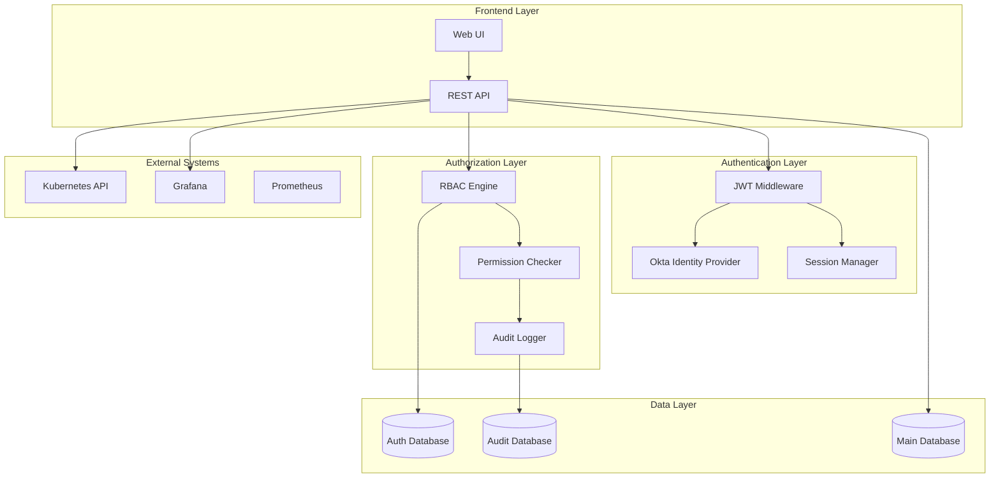

# Setagaya RBAC Technical Specification
## Implementation Guide for Role-Based Access Control with Okta Integration

**Version**: 1.0
**Date**: September 11, 2025
**Related Document**: [RBAC Development Plan](./RBAC_DEVELOPMENT_PLAN.md)

---

## Test-Driven Development Implementation

### TDD Methodology for RBAC

The RBAC implementation follows strict TDD principles with **80% minimum test coverage** target:

#### **Testing Pyramid Structure**
```
        /\
       /  \
      /E2E \     15% - End-to-End Tests
     /______\
    /        \
   /Integration\ 25% - Integration Tests
  /__________\
 /            \
/  Unit Tests  \  40% - Unit Tests
/______________\
```

### API-First Development with OpenAPI

#### **Complete OpenAPI 3.0 Specification**

```yaml
openapi: 3.0.3
info:
  title: Setagaya RBAC API
  version: 3.0.0
  description: Enterprise Role-Based Access Control API

paths:
  /api/auth/login:
    get:
      summary: Initiate Okta OIDC login
      tags: [Authentication]
      responses:
        '302':
          description: Redirect to Okta login
          headers:
            Location:
              schema:
                type: string
              description: Okta authorization URL

  /api/auth/callback:
    get:
      summary: Handle Okta OIDC callback
      tags: [Authentication]
      parameters:
        - name: code
          in: query
          required: true
          schema:
            type: string
        - name: state
          in: query
          required: true
          schema:
            type: string
      responses:
        '200':
          description: Authentication successful
          content:
            application/json:
              schema:
                $ref: '#/components/schemas/AuthResponse'

  /api/tenants:
    get:
      summary: List tenants
      tags: [Tenant Management]
      security:
        - bearerAuth: []
      parameters:
        - name: limit
          in: query
          schema:
            type: integer
            default: 50
        - name: offset
          in: query
          schema:
            type: integer
            default: 0
      responses:
        '200':
          description: List of tenants
          content:
            application/json:
              schema:
                type: array
                items:
                  $ref: '#/components/schemas/Tenant'

    post:
      summary: Create new tenant
      tags: [Tenant Management]
      security:
        - bearerAuth: []
      requestBody:
        required: true
        content:
          application/json:
            schema:
              $ref: '#/components/schemas/CreateTenantRequest'
      responses:
        '201':
          description: Tenant created
          content:
            application/json:
              schema:
                $ref: '#/components/schemas/Tenant'

components:
  schemas:
    AuthResponse:
      type: object
      properties:
        access_token:
          type: string
        token_type:
          type: string
          enum: [Bearer]
        expires_in:
          type: integer
        user:
          $ref: '#/components/schemas/User'

    User:
      type: object
      properties:
        id:
          type: string
        email:
          type: string
        name:
          type: string
        roles:
          type: array
          items:
            $ref: '#/components/schemas/UserRole'

    Tenant:
      type: object
      properties:
        id:
          type: integer
          format: int64
        name:
          type: string
        display_name:
          type: string
        status:
          type: string
          enum: [ACTIVE, SUSPENDED, DELETED]
        quota_config:
          type: object
        created_at:
          type: string
          format: date-time

  securitySchemes:
    bearerAuth:
      type: http
      scheme: bearer
      bearerFormat: JWT
```

### System Components



---

## Test Implementation Examples

### Unit Test Examples (Target: 40% of coverage)

#### **RBAC Engine Unit Tests**

```go
package rbac_test

import (
    "context"
    "testing"
    "time"

    "github.com/stretchr/testify/assert"
    "github.com/stretchr/testify/require"
    "github.com/hveda/Setagaya/setagaya/rbac"
)

func TestRBACEngine_CheckPermission(t *testing.T) {
    tests := []struct {
        name        string
        userContext *rbac.UserContext
        request     *rbac.AuthorizationRequest
        expected    bool
        reason      string
    }{
        {
            name: "service provider admin can access all tenants",
            userContext: &rbac.UserContext{
                UserID: "admin@company.com",
                GlobalRoles: []rbac.Role{
                    {Name: "service_provider_admin", Permissions: []rbac.Permission{
                        {Resource: "tenant", Actions: []string{"*"}, Scope: "global"},
                    }},
                },
                IsServiceProvider: true,
            },
            request: &rbac.AuthorizationRequest{
                Action:       "read",
                ResourceType: "tenant",
                TenantID:     &[]int64{1}[0],
            },
            expected: true,
            reason:   "Service provider admin has global access",
        },
        {
            name: "tenant editor can create projects in their tenant",
            userContext: &rbac.UserContext{
                UserID: "editor@tenant1.com",
                TenantAccess: map[int64][]rbac.Role{
                    1: {{Name: "tenant_editor", Permissions: []rbac.Permission{
                        {Resource: "project", Actions: []string{"create", "read", "update"}, Scope: "tenant"},
                    }}},
                },
            },
            request: &rbac.AuthorizationRequest{
                Action:       "create",
                ResourceType: "project",
                TenantID:     &[]int64{1}[0],
            },
            expected: true,
            reason:   "Tenant editor can create projects in their tenant",
        },
        {
            name: "tenant viewer cannot create projects",
            userContext: &rbac.UserContext{
                UserID: "viewer@tenant1.com",
                TenantAccess: map[int64][]rbac.Role{
                    1: {{Name: "tenant_viewer", Permissions: []rbac.Permission{
                        {Resource: "project", Actions: []string{"read"}, Scope: "tenant"},
                    }}},
                },
            },
            request: &rbac.AuthorizationRequest{
                Action:       "create",
                ResourceType: "project",
                TenantID:     &[]int64{1}[0],
            },
            expected: false,
            reason:   "Tenant viewer only has read permissions",
        },
        {
            name: "cross-tenant access denied",
            userContext: &rbac.UserContext{
                UserID: "editor@tenant1.com",
                TenantAccess: map[int64][]rbac.Role{
                    1: {{Name: "tenant_editor"}},
                },
            },
            request: &rbac.AuthorizationRequest{
                Action:       "read",
                ResourceType: "project",
                TenantID:     &[]int64{2}[0], // Different tenant
            },
            expected: false,
            reason:   "User does not have access to tenant 2",
        },
    }

    for _, tt := range tests {
        t.Run(tt.name, func(t *testing.T) {
            engine := rbac.NewRBACEngine(&rbac.Config{
                CacheTTL: 5 * time.Minute,
            })

            result, err := engine.CheckPermission(context.Background(), tt.request)
            require.NoError(t, err)
            assert.Equal(t, tt.expected, result.Allowed)
            assert.Contains(t, result.Reason, tt.reason)
        })
    }
}

func TestTenantModel_CreateTenant(t *testing.T) {
    tests := []struct {
        name     string
        tenant   *rbac.Tenant
        wantErr  bool
        errMsg   string
    }{
        {
            name: "valid tenant creation",
            tenant: &rbac.Tenant{
                Name:            "test-tenant",
                DisplayName:     "Test Tenant",
                OktaGroupPrefix: "setagaya-test",
                Status:          "ACTIVE",
            },
            wantErr: false,
        },
        {
            name: "duplicate tenant name",
            tenant: &rbac.Tenant{
                Name:            "duplicate-tenant",
                DisplayName:     "Duplicate Tenant",
                OktaGroupPrefix: "setagaya-duplicate",
            },
            wantErr: true,
            errMsg:  "tenant name already exists",
        },
        {
            name: "invalid okta group prefix",
            tenant: &rbac.Tenant{
                Name:            "invalid-tenant",
                DisplayName:     "Invalid Tenant",
                OktaGroupPrefix: "invalid prefix with spaces",
            },
            wantErr: true,
            errMsg:  "invalid okta group prefix format",
        },
    }

    for _, tt := range tests {
        t.Run(tt.name, func(t *testing.T) {
            // Setup test database
            db := setupTestDB(t)
            defer teardownTestDB(t, db)

            engine := rbac.NewRBACEngine(&rbac.Config{DB: db})

            err := engine.CreateTenant(context.Background(), tt.tenant)

            if tt.wantErr {
                assert.Error(t, err)
                assert.Contains(t, err.Error(), tt.errMsg)
            } else {
                assert.NoError(t, err)
                assert.NotZero(t, tt.tenant.ID)
                assert.NotZero(t, tt.tenant.CreatedAt)
            }
        })
    }
}
```

#### **JWT Token Validation Tests**

```go
func TestOktaAuthProvider_ValidateToken(t *testing.T) {
    tests := []struct {
        name      string
        token     string
        setupMock func(*MockOktaProvider)
        wantErr   bool
        errMsg    string
    }{
        {
            name:  "valid token with standard claims",
            token: "valid.jwt.token",
            setupMock: func(m *MockOktaProvider) {
                m.On("GetPublicKey", "kid123").Return(testPublicKey, nil)
            },
            wantErr: false,
        },
        {
            name:  "expired token",
            token: "expired.jwt.token",
            setupMock: func(m *MockOktaProvider) {
                m.On("GetPublicKey", "kid123").Return(testPublicKey, nil)
            },
            wantErr: true,
            errMsg:  "token is expired",
        },
        {
            name:  "invalid signature",
            token: "invalid.signature.token",
            setupMock: func(m *MockOktaProvider) {
                m.On("GetPublicKey", "kid123").Return(testPublicKey, nil)
            },
            wantErr: true,
            errMsg:  "signature verification failed",
        },
        {
            name:  "missing required claims",
            token: "missing.claims.token",
            setupMock: func(m *MockOktaProvider) {
                m.On("GetPublicKey", "kid123").Return(testPublicKey, nil)
            },
            wantErr: true,
            errMsg:  "missing required claims",
        },
    }

    for _, tt := range tests {
        t.Run(tt.name, func(t *testing.T) {
            mockProvider := &MockOktaProvider{}
            tt.setupMock(mockProvider)
            defer mockProvider.AssertExpectations(t)

            provider := &auth.OktaAuthProvider{
                Config:     testOktaConfig,
                MockClient: mockProvider,
            }

            claims, err := provider.ValidateToken(tt.token)

            if tt.wantErr {
                assert.Error(t, err)
                assert.Contains(t, err.Error(), tt.errMsg)
                assert.Nil(t, claims)
            } else {
                assert.NoError(t, err)
                assert.NotNil(t, claims)
                assert.NotEmpty(t, claims.Subject)
            }
        })
    }
}
```

### Integration Test Examples (Target: 25% of coverage)

#### **API Integration Tests**

```go
func TestTenantAPI_Integration(t *testing.T) {
    // Setup test server with real database
    testServer := setupTestServer(t)
    defer testServer.Close()

    // Create test user with service provider admin role
    adminToken := createTestUser(t, testServer, "admin@company.com", "service_provider_admin")

    t.Run("Create and manage tenant lifecycle", func(t *testing.T) {
        // Test tenant creation
        createReq := &CreateTenantRequest{
            Name:            "integration-test-tenant",
            DisplayName:     "Integration Test Tenant",
            OktaGroupPrefix: "setagaya-integration-test",
        }

        tenant := createTenant(t, testServer, adminToken, createReq)
        assert.Equal(t, createReq.Name, tenant.Name)
        assert.Equal(t, "ACTIVE", tenant.Status)

        // Test tenant retrieval
        fetchedTenant := getTenant(t, testServer, adminToken, tenant.ID)
        assert.Equal(t, tenant.ID, fetchedTenant.ID)
        assert.Equal(t, tenant.Name, fetchedTenant.Name)

        // Test tenant update
        updateReq := &UpdateTenantRequest{
            DisplayName: "Updated Integration Test Tenant",
        }
        updatedTenant := updateTenant(t, testServer, adminToken, tenant.ID, updateReq)
        assert.Equal(t, updateReq.DisplayName, updatedTenant.DisplayName)

        // Test tenant user assignment
        userToken := createTestUser(t, testServer, "user@integration-test.com", "tenant_editor")
        assignUserToTenant(t, testServer, adminToken, tenant.ID, "user@integration-test.com", "tenant_editor")

        // Verify user can access tenant resources
        userTenants := getUserTenants(t, testServer, userToken)
        assert.Len(t, userTenants, 1)
        assert.Equal(t, tenant.ID, userTenants[0].ID)

        // Test tenant deletion
        deleteTenant(t, testServer, adminToken, tenant.ID)

        // Verify tenant is marked as deleted
        deletedTenant := getTenant(t, testServer, adminToken, tenant.ID)
        assert.Equal(t, "DELETED", deletedTenant.Status)
    })
}

func TestProjectAPI_TenantIsolation(t *testing.T) {
    testServer := setupTestServer(t)
    defer testServer.Close()

    // Create two separate tenants
    adminToken := createTestUser(t, testServer, "admin@company.com", "service_provider_admin")

    tenant1 := createTenant(t, testServer, adminToken, &CreateTenantRequest{
        Name: "tenant1", OktaGroupPrefix: "setagaya-tenant1",
    })
    tenant2 := createTenant(t, testServer, adminToken, &CreateTenantRequest{
        Name: "tenant2", OktaGroupPrefix: "setagaya-tenant2",
    })

    // Create users for each tenant
    user1Token := createTestUser(t, testServer, "user1@tenant1.com", "tenant_editor")
    user2Token := createTestUser(t, testServer, "user2@tenant2.com", "tenant_editor")

    assignUserToTenant(t, testServer, adminToken, tenant1.ID, "user1@tenant1.com", "tenant_editor")
    assignUserToTenant(t, testServer, adminToken, tenant2.ID, "user2@tenant2.com", "tenant_editor")

    t.Run("Users can only access their tenant's projects", func(t *testing.T) {
        // User1 creates project in tenant1
        project1 := createProject(t, testServer, user1Token, &CreateProjectRequest{
            Name:     "tenant1-project",
            TenantID: tenant1.ID,
        })

        // User2 creates project in tenant2
        project2 := createProject(t, testServer, user2Token, &CreateProjectRequest{
            Name:     "tenant2-project",
            TenantID: tenant2.ID,
        })

        // User1 can access their project
        fetchedProject1 := getProject(t, testServer, user1Token, project1.ID)
        assert.Equal(t, project1.ID, fetchedProject1.ID)

        // User1 cannot access tenant2's project
        getProjectExpectForbidden(t, testServer, user1Token, project2.ID)

        // User2 can access their project
        fetchedProject2 := getProject(t, testServer, user2Token, project2.ID)
        assert.Equal(t, project2.ID, fetchedProject2.ID)

        // User2 cannot access tenant1's project
        getProjectExpectForbidden(t, testServer, user2Token, project1.ID)

        // List projects returns only tenant-scoped results
        user1Projects := listProjects(t, testServer, user1Token)
        assert.Len(t, user1Projects, 1)
        assert.Equal(t, project1.ID, user1Projects[0].ID)

        user2Projects := listProjects(t, testServer, user2Token)
        assert.Len(t, user2Projects, 1)
        assert.Equal(t, project2.ID, user2Projects[0].ID)
    })
}
```

### End-to-End Test Examples (Target: 15% of coverage)

#### **Complete User Journey Tests**

```go
func TestE2E_TenantAdminWorkflow(t *testing.T) {
    if testing.Short() {
        t.Skip("Skipping E2E test in short mode")
    }

    // Setup complete test environment with Okta mock
    testEnv := setupE2EEnvironment(t)
    defer testEnv.Cleanup()

    t.Run("Complete tenant admin workflow", func(t *testing.T) {
        // 1. Service provider creates tenant
        adminSession := testEnv.LoginAsServiceProviderAdmin()
        tenant := adminSession.CreateTenant("acme-corp", "ACME Corporation")

        // 2. Tenant admin user is created in Okta (mocked)
        tenantAdminEmail := "admin@acme-corp.com"
        testEnv.OktaMock.CreateUser(tenantAdminEmail, []string{"setagaya-acme-corp-admin"})

        // 3. Tenant admin logs in for first time
        tenantAdminSession := testEnv.LoginAsUser(tenantAdminEmail)

        // 4. Tenant admin verifies access to their tenant
        tenants := tenantAdminSession.ListAccessibleTenants()
        assert.Len(t, tenants, 1)
        assert.Equal(t, tenant.ID, tenants[0].ID)

        // 5. Tenant admin creates editor user
        editorEmail := "editor@acme-corp.com"
        testEnv.OktaMock.CreateUser(editorEmail, []string{"setagaya-acme-corp-editor"})
        tenantAdminSession.AssignUserToTenant(tenant.ID, editorEmail, "tenant_editor")

        // 6. Editor logs in and creates project
        editorSession := testEnv.LoginAsUser(editorEmail)
        project := editorSession.CreateProject("load-test-project", tenant.ID)

        // 7. Editor creates collection
        collection := editorSession.CreateCollection("performance-test", project.ID)

        // 8. Editor uploads test plan
        testPlan := editorSession.UploadTestPlan(project.ID, "sample-test.jmx", testJMXContent)

        // 9. Editor configures execution plan
        executionPlan := editorSession.CreateExecutionPlan(collection.ID, testPlan.ID, 10) // 10 engines

        // 10. Editor deploys and runs test
        deployment := editorSession.DeployCollection(collection.ID)
        assert.Equal(t, "DEPLOYED", deployment.Status)

        run := editorSession.TriggerCollection(collection.ID)
        assert.Equal(t, "RUNNING", run.Status)

        // 11. Wait for test completion and verify results
        testEnv.WaitForTestCompletion(run.ID, 2*time.Minute)

        results := editorSession.GetTestResults(collection.ID, run.ID)
        assert.NotEmpty(t, results.Metrics)
        assert.Greater(t, results.TotalRequests, int64(0))

        // 12. Tenant admin reviews usage and metrics
        usage := tenantAdminSession.GetTenantUsage(tenant.ID)
        assert.Equal(t, 1, usage.Projects)
        assert.Equal(t, 1, usage.Collections)
        assert.Greater(t, usage.EngineHours, 0.0)

        // 13. Cleanup
        editorSession.TerminateCollection(collection.ID)
        editorSession.PurgeCollection(collection.ID)
    })
}

func TestE2E_CrossTenantIsolation(t *testing.T) {
    testEnv := setupE2EEnvironment(t)
    defer testEnv.Cleanup()

    // Create two completely isolated tenants
    adminSession := testEnv.LoginAsServiceProviderAdmin()

    tenant1 := adminSession.CreateTenant("company-a", "Company A")
    tenant2 := adminSession.CreateTenant("company-b", "Company B")

    // Create users for each tenant
    user1Email := "user@company-a.com"
    user2Email := "user@company-b.com"

    testEnv.OktaMock.CreateUser(user1Email, []string{"setagaya-company-a-editor"})
    testEnv.OktaMock.CreateUser(user2Email, []string{"setagaya-company-b-editor"})

    adminSession.AssignUserToTenant(tenant1.ID, user1Email, "tenant_editor")
    adminSession.AssignUserToTenant(tenant2.ID, user2Email, "tenant_editor")

    user1Session := testEnv.LoginAsUser(user1Email)
    user2Session := testEnv.LoginAsUser(user2Email)

    t.Run("Complete isolation between tenants", func(t *testing.T) {
        // Each user creates resources in their tenant
        project1 := user1Session.CreateProject("project1", tenant1.ID)
        project2 := user2Session.CreateProject("project2", tenant2.ID)

        // Verify users can only see their own resources
        user1Projects := user1Session.ListProjects()
        assert.Len(t, user1Projects, 1)
        assert.Equal(t, project1.ID, user1Projects[0].ID)

        user2Projects := user2Session.ListProjects()
        assert.Len(t, user2Projects, 1)
        assert.Equal(t, project2.ID, user2Projects[0].ID)

        // Verify cross-tenant access is blocked
        user1Session.ExpectForbiddenAccess("/api/projects/" + strconv.FormatInt(project2.ID, 10))
        user2Session.ExpectForbiddenAccess("/api/projects/" + strconv.FormatInt(project1.ID, 10))

        // Verify Kubernetes namespace isolation
        user1Namespaces := testEnv.GetUserAccessibleNamespaces(user1Email)
        user2Namespaces := testEnv.GetUserAccessibleNamespaces(user2Email)

        assert.NotEqual(t, user1Namespaces, user2Namespaces)
        assert.Contains(t, user1Namespaces[0], "company-a")
        assert.Contains(t, user2Namespaces[0], "company-b")

        // Verify audit logs are tenant-scoped
        user1Logs := user1Session.GetAuditLogs()
        user2Logs := user2Session.GetAuditLogs()

        for _, log := range user1Logs {
            assert.Equal(t, tenant1.ID, log.TenantID)
        }

        for _, log := range user2Logs {
            assert.Equal(t, tenant2.ID, log.TenantID)
        }
    })
}
```

### Test Coverage Validation

#### **Coverage Reporting Setup**

```go
// Makefile targets for test coverage
test-coverage:
	go test -v -race -coverprofile=coverage.out ./rbac/...
	go tool cover -html=coverage.out -o coverage.html
	go tool cover -func=coverage.out | grep total | awk '{print "Total coverage: " $$3}'
	@echo "Coverage report generated: coverage.html"

test-coverage-ci:
	go test -v -race -coverprofile=coverage.out ./rbac/...
	go tool cover -func=coverage.out | grep total | awk '{print $$3}' | sed 's/%//' > coverage.txt
	@COVERAGE=$$(cat coverage.txt); \
	if [ "$${COVERAGE%.*}" -lt "80" ]; then \
		echo "ERROR: Test coverage ($${COVERAGE}%) is below minimum (80%)"; \
		exit 1; \
	else \
		echo "SUCCESS: Test coverage ($${COVERAGE}%) meets minimum requirement"; \
	fi

test-unit:
	go test -v -race -short ./rbac/...

test-integration:
	go test -v -race -tags=integration ./rbac/...

test-e2e:
	go test -v -race -tags=e2e ./rbac/...
```

#### **GitHub Actions Coverage Gate**

```yaml
name: Test Coverage Gate
on: [push, pull_request]

jobs:
  test-coverage:
    runs-on: ubuntu-latest
    steps:
      - uses: actions/checkout@v4
      - uses: actions/setup-go@v4
        with:
          go-version: '1.25.1'

      - name: Run tests with coverage
        run: make test-coverage-ci

      - name: Upload coverage to Codecov
        uses: codecov/codecov-action@v3
        with:
          file: ./coverage.out
          fail_ci_if_error: true

      - name: Coverage Gate
        run: |
          COVERAGE=$(go tool cover -func=coverage.out | grep total | awk '{print $3}' | sed 's/%//')
          echo "Current coverage: ${COVERAGE}%"
          if [ "${COVERAGE%.*}" -lt "80" ]; then
            echo "❌ Coverage ${COVERAGE}% is below minimum 80%"
            exit 1
          else
            echo "✅ Coverage ${COVERAGE}% meets minimum requirement"
          fi
```

This comprehensive testing approach ensures that the RBAC implementation maintains the required 80% test coverage while following TDD principles and API-first development methodology.

---

## Complete OpenAPI 3.0 Specification

```yaml
openapi: 3.0.3
info:
  title: Setagaya RBAC API
  description: |
    Role-Based Access Control API for Setagaya Load Testing Platform.

    This API provides comprehensive tenant management, user authorization,
    and audit capabilities for multi-tenant load testing environments.

    ## Authentication
    All endpoints require JWT authentication via Okta OIDC integration.
    Include the JWT token in the Authorization header:
    `Authorization: Bearer <your-jwt-token>`

    ## Authorization
    Access to resources is controlled by role-based permissions:
    - **Service Provider Admin**: Global access to all tenants and resources
    - **Service Provider Support**: Read-only access for support operations
    - **Tenant Admin**: Full access within assigned tenant(s)
    - **Tenant Editor**: Create/edit resources within assigned tenant(s)
    - **Tenant Viewer**: Read-only access within assigned tenant(s)
    - **PJM Loadtest**: Project manager access for load testing operations

    ## Rate Limiting
    API requests are rate limited to 1000 requests per hour per user.
    Rate limit headers are included in all responses.

  version: 1.0.0
  contact:
    name: Setagaya Platform Team
    email: platform-team@company.com
  license:
    name: MIT
    url: https://opensource.org/licenses/MIT

servers:
  - url: https://setagaya.company.com/api/v1
    description: Production server
  - url: https://setagaya-staging.company.com/api/v1
    description: Staging server
  - url: http://localhost:8080/api/v1
    description: Local development server

security:
  - BearerAuth: []

paths:
  /tenants:
    get:
      summary: List tenants
      description: |
        Retrieve list of tenants based on user permissions:
        - Service Provider Admins see all tenants
        - Other users see only tenants they have access to
      security:
        - BearerAuth: []
      parameters:
        - name: status
          in: query
          description: Filter tenants by status
          schema:
            type: string
            enum: [ACTIVE, SUSPENDED, DELETED]
        - name: limit
          in: query
          description: Maximum number of tenants to return
          schema:
            type: integer
            minimum: 1
            maximum: 100
            default: 20
        - name: offset
          in: query
          description: Number of tenants to skip for pagination
          schema:
            type: integer
            minimum: 0
            default: 0
      responses:
        '200':
          description: List of tenants
          headers:
            X-Total-Count:
              description: Total number of tenants matching criteria
              schema:
                type: integer
            X-Rate-Limit-Remaining:
              description: Number of requests remaining in rate limit window
              schema:
                type: integer
          content:
            application/json:
              schema:
                type: object
                properties:
                  tenants:
                    type: array
                    items:
                      $ref: '#/components/schemas/Tenant'
                  total:
                    type: integer
                    description: Total number of matching tenants
                  limit:
                    type: integer
                  offset:
                    type: integer
        '401':
          $ref: '#/components/responses/Unauthorized'
        '403':
          $ref: '#/components/responses/Forbidden'
        '429':
          $ref: '#/components/responses/RateLimited'
        '500':
          $ref: '#/components/responses/InternalError'

    post:
      summary: Create new tenant
      description: |
        Create a new tenant in the system. Only Service Provider Admins
        can create tenants. The Okta group prefix must be unique and follow
        the naming convention 'setagaya-{tenant-name}'.
      security:
        - BearerAuth: []
      requestBody:
        required: true
        content:
          application/json:
            schema:
              $ref: '#/components/schemas/CreateTenantRequest'
            examples:
              basic_tenant:
                summary: Basic tenant creation
                value:
                  name: "acme-corp"
                  display_name: "ACME Corporation"
                  okta_group_prefix: "setagaya-acme-corp"
              tenant_with_metadata:
                summary: Tenant with custom metadata
                value:
                  name: "tech-startup"
                  display_name: "Tech Startup Inc"
                  okta_group_prefix: "setagaya-tech-startup"
                  metadata:
                    industry: "technology"
                    region: "us-west"
                    tier: "premium"
      responses:
        '201':
          description: Tenant created successfully
          content:
            application/json:
              schema:
                $ref: '#/components/schemas/Tenant'
        '400':
          description: Invalid request data
          content:
            application/json:
              schema:
                $ref: '#/components/schemas/Error'
              examples:
                invalid_name:
                  summary: Invalid tenant name
                  value:
                    error: "validation_error"
                    message: "Tenant name must contain only lowercase letters, numbers, and hyphens"
                    details:
                      field: "name"
                      value: "Invalid Name!"
                duplicate_name:
                  summary: Duplicate tenant name
                  value:
                    error: "conflict"
                    message: "Tenant with this name already exists"
        '401':
          $ref: '#/components/responses/Unauthorized'
        '403':
          $ref: '#/components/responses/Forbidden'
        '429':
          $ref: '#/components/responses/RateLimited'
        '500':
          $ref: '#/components/responses/InternalError'

  /tenants/{tenantId}:
    get:
      summary: Get tenant details
      description: Retrieve detailed information about a specific tenant
      security:
        - BearerAuth: []
      parameters:
        - name: tenantId
          in: path
          required: true
          description: Unique identifier for the tenant
          schema:
            type: integer
            format: int64
            example: 123
      responses:
        '200':
          description: Tenant details
          content:
            application/json:
              schema:
                $ref: '#/components/schemas/Tenant'
        '401':
          $ref: '#/components/responses/Unauthorized'
        '403':
          $ref: '#/components/responses/Forbidden'
        '404':
          description: Tenant not found
          content:
            application/json:
              schema:
                $ref: '#/components/schemas/Error'
              example:
                error: "not_found"
                message: "Tenant with ID 123 not found"
        '429':
          $ref: '#/components/responses/RateLimited'
        '500':
          $ref: '#/components/responses/InternalError'

    put:
      summary: Update tenant
      description: |
        Update tenant information. Only Service Provider Admins and
        Tenant Admins can update tenant details.
      security:
        - BearerAuth: []
      parameters:
        - name: tenantId
          in: path
          required: true
          schema:
            type: integer
            format: int64
      requestBody:
        required: true
        content:
          application/json:
            schema:
              $ref: '#/components/schemas/UpdateTenantRequest'
            examples:
              update_display_name:
                summary: Update display name
                value:
                  display_name: "ACME Corporation Ltd"
              suspend_tenant:
                summary: Suspend tenant
                value:
                  status: "SUSPENDED"
                  metadata:
                    suspension_reason: "Payment overdue"
      responses:
        '200':
          description: Tenant updated successfully
          content:
            application/json:
              schema:
                $ref: '#/components/schemas/Tenant'
        '400':
          $ref: '#/components/responses/BadRequest'
        '401':
          $ref: '#/components/responses/Unauthorized'
        '403':
          $ref: '#/components/responses/Forbidden'
        '404':
          $ref: '#/components/responses/NotFound'
        '429':
          $ref: '#/components/responses/RateLimited'
        '500':
          $ref: '#/components/responses/InternalError'

    delete:
      summary: Delete tenant
      description: |
        Soft delete a tenant by marking it as DELETED status.
        Only Service Provider Admins can delete tenants.
        This operation is irreversible and will clean up all associated resources.
      security:
        - BearerAuth: []
      parameters:
        - name: tenantId
          in: path
          required: true
          schema:
            type: integer
            format: int64
      responses:
        '204':
          description: Tenant deleted successfully
        '401':
          $ref: '#/components/responses/Unauthorized'
        '403':
          $ref: '#/components/responses/Forbidden'
        '404':
          $ref: '#/components/responses/NotFound'
        '409':
          description: Cannot delete tenant with active resources
          content:
            application/json:
              schema:
                $ref: '#/components/schemas/Error'
              example:
                error: "conflict"
                message: "Cannot delete tenant with active projects or running tests"
                details:
                  active_projects: 5
                  running_collections: 2
        '429':
          $ref: '#/components/responses/RateLimited'
        '500':
          $ref: '#/components/responses/InternalError'

  /tenants/{tenantId}/users:
    get:
      summary: List tenant users
      description: |
        List all users assigned to a tenant with their roles.
        Accessible by Service Provider Admins and Tenant Admins.
      security:
        - BearerAuth: []
      parameters:
        - name: tenantId
          in: path
          required: true
          schema:
            type: integer
            format: int64
        - name: role
          in: query
          description: Filter users by role
          schema:
            type: string
            enum: [tenant_admin, tenant_editor, tenant_viewer, pjm_loadtest]
      responses:
        '200':
          description: List of tenant users
          content:
            application/json:
              schema:
                type: array
                items:
                  $ref: '#/components/schemas/TenantUserAssignment'
        '401':
          $ref: '#/components/responses/Unauthorized'
        '403':
          $ref: '#/components/responses/Forbidden'
        '404':
          $ref: '#/components/responses/NotFound'

    post:
      summary: Assign user to tenant
      description: |
        Assign a user to a tenant with a specific role.
        The user must exist in Okta and be a member of the appropriate Okta group.
      security:
        - BearerAuth: []
      parameters:
        - name: tenantId
          in: path
          required: true
          schema:
            type: integer
            format: int64
      requestBody:
        required: true
        content:
          application/json:
            schema:
              $ref: '#/components/schemas/TenantUserAssignment'
            examples:
              assign_admin:
                summary: Assign tenant admin
                value:
                  user_id: "admin@acme-corp.com"
                  role_name: "tenant_admin"
              assign_editor:
                summary: Assign tenant editor
                value:
                  user_id: "developer@acme-corp.com"
                  role_name: "tenant_editor"
      responses:
        '201':
          description: User assigned successfully
          content:
            application/json:
              schema:
                $ref: '#/components/schemas/TenantUserAssignment'
        '400':
          $ref: '#/components/responses/BadRequest'
        '401':
          $ref: '#/components/responses/Unauthorized'
        '403':
          $ref: '#/components/responses/Forbidden'
        '404':
          description: User or tenant not found
          content:
            application/json:
              schema:
                $ref: '#/components/schemas/Error'
              example:
                error: "not_found"
                message: "User not found in Okta directory"

  /tenants/{tenantId}/users/{userId}:
    delete:
      summary: Remove user from tenant
      description: Remove a user's access to a tenant
      security:
        - BearerAuth: []
      parameters:
        - name: tenantId
          in: path
          required: true
          schema:
            type: integer
            format: int64
        - name: userId
          in: path
          required: true
          schema:
            type: string
            format: email
      responses:
        '204':
          description: User removed successfully
        '401':
          $ref: '#/components/responses/Unauthorized'
        '403':
          $ref: '#/components/responses/Forbidden'
        '404':
          $ref: '#/components/responses/NotFound'

  /roles:
    get:
      summary: List available roles
      description: Get list of all available roles in the system
      security:
        - BearerAuth: []
      parameters:
        - name: scope
          in: query
          description: Filter roles by scope (global, tenant)
          schema:
            type: string
            enum: [global, tenant]
      responses:
        '200':
          description: List of roles
          content:
            application/json:
              schema:
                type: array
                items:
                  $ref: '#/components/schemas/Role'
        '401':
          $ref: '#/components/responses/Unauthorized'
        '403':
          $ref: '#/components/responses/Forbidden'

  /permissions:
    get:
      summary: List available permissions
      description: Get list of all available permissions for resources
      security:
        - BearerAuth: []
      parameters:
        - name: resource
          in: query
          description: Filter permissions by resource type
          schema:
            type: string
            enum: [tenant, project, collection, plan, execution]
      responses:
        '200':
          description: List of permissions
          content:
            application/json:
              schema:
                type: array
                items:
                  $ref: '#/components/schemas/Permission'

  /audit:
    get:
      summary: Get audit logs
      description: |
        Retrieve audit logs with optional filtering.
        Service Provider Admins can see all logs.
        Tenant users can only see logs for their tenants.
      security:
        - BearerAuth: []
      parameters:
        - name: tenant_id
          in: query
          description: Filter by tenant ID (tenant-scoped for non-admin users)
          schema:
            type: integer
            format: int64
        - name: user_id
          in: query
          description: Filter by user ID
          schema:
            type: string
        - name: action
          in: query
          description: Filter by action type
          schema:
            type: string
        - name: resource_type
          in: query
          description: Filter by resource type
          schema:
            type: string
        - name: from_date
          in: query
          description: Start date for log retrieval (ISO 8601)
          schema:
            type: string
            format: date-time
            example: "2024-01-01T00:00:00Z"
        - name: to_date
          in: query
          description: End date for log retrieval (ISO 8601)
          schema:
            type: string
            format: date-time
            example: "2024-01-31T23:59:59Z"
        - name: limit
          in: query
          description: Maximum number of logs to return
          schema:
            type: integer
            minimum: 1
            maximum: 1000
            default: 100
        - name: offset
          in: query
          description: Number of logs to skip for pagination
          schema:
            type: integer
            minimum: 0
            default: 0
      responses:
        '200':
          description: Audit logs
          content:
            application/json:
              schema:
                type: object
                properties:
                  logs:
                    type: array
                    items:
                      $ref: '#/components/schemas/AuditLog'
                  total:
                    type: integer
                    description: Total number of matching logs
                  limit:
                    type: integer
                  offset:
                    type: integer
        '401':
          $ref: '#/components/responses/Unauthorized'
        '403':
          $ref: '#/components/responses/Forbidden'

  /auth/me:
    get:
      summary: Get current user context
      description: |
        Retrieve information about the currently authenticated user,
        including their tenants, roles, and permissions.
      security:
        - BearerAuth: []
      responses:
        '200':
          description: Current user context
          content:
            application/json:
              schema:
                $ref: '#/components/schemas/UserContext'
        '401':
          $ref: '#/components/responses/Unauthorized'

components:
  securitySchemes:
    BearerAuth:
      type: http
      scheme: bearer
      bearerFormat: JWT
      description: |
        JWT token obtained from Okta OIDC authentication.
        Include the token in the Authorization header as: `Bearer <token>`

  responses:
    Unauthorized:
      description: Authentication required
      content:
        application/json:
          schema:
            $ref: '#/components/schemas/Error'
          example:
            error: "unauthorized"
            message: "Valid JWT token required"

    Forbidden:
      description: Access denied
      content:
        application/json:
          schema:
            $ref: '#/components/schemas/Error'
          example:
            error: "forbidden"
            message: "Insufficient permissions for this operation"

    BadRequest:
      description: Invalid request data
      content:
        application/json:
          schema:
            $ref: '#/components/schemas/Error'
          example:
            error: "validation_error"
            message: "Invalid request parameters"

    NotFound:
      description: Resource not found
      content:
        application/json:
          schema:
            $ref: '#/components/schemas/Error'
          example:
            error: "not_found"
            message: "The requested resource was not found"

    RateLimited:
      description: Rate limit exceeded
      headers:
        X-Rate-Limit-Reset:
          description: Unix timestamp when rate limit resets
          schema:
            type: integer
        Retry-After:
          description: Seconds to wait before retrying
          schema:
            type: integer
      content:
        application/json:
          schema:
            $ref: '#/components/schemas/Error'
          example:
            error: "rate_limited"
            message: "Rate limit exceeded. Try again in 60 seconds."

    InternalError:
      description: Internal server error
      content:
        application/json:
          schema:
            $ref: '#/components/schemas/Error'
          example:
            error: "internal_error"
            message: "An unexpected error occurred"

  schemas:
    Tenant:
      type: object
      required:
        - name
        - display_name
        - okta_group_prefix
      properties:
        id:
          type: integer
          format: int64
          readOnly: true
          description: Unique identifier for the tenant
          example: 123
        name:
          type: string
          pattern: '^[a-z0-9-]+$'
          minLength: 3
          maxLength: 50
          description: Unique tenant name (lowercase, alphanumeric, hyphens)
          example: "acme-corp"
        display_name:
          type: string
          minLength: 1
          maxLength: 100
          description: Human-readable tenant name
          example: "ACME Corporation"
        okta_group_prefix:
          type: string
          pattern: '^setagaya-[a-z0-9-]+$'
          description: Prefix for Okta groups (must start with 'setagaya-')
          example: "setagaya-acme-corp"
        status:
          type: string
          enum: [ACTIVE, SUSPENDED, DELETED]
          description: Current tenant status
          example: "ACTIVE"
        created_at:
          type: string
          format: date-time
          readOnly: true
          example: "2024-01-15T10:30:00Z"
        updated_at:
          type: string
          format: date-time
          readOnly: true
          example: "2024-01-15T10:30:00Z"
        metadata:
          type: object
          additionalProperties: true
          description: Additional tenant-specific configuration
          example:
            industry: "technology"
            region: "us-west"
            tier: "premium"

    CreateTenantRequest:
      type: object
      required:
        - name
        - display_name
        - okta_group_prefix
      properties:
        name:
          type: string
          pattern: '^[a-z0-9-]+$'
          minLength: 3
          maxLength: 50
          example: "acme-corp"
        display_name:
          type: string
          minLength: 1
          maxLength: 100
          example: "ACME Corporation"
        okta_group_prefix:
          type: string
          pattern: '^setagaya-[a-z0-9-]+$'
          example: "setagaya-acme-corp"
        metadata:
          type: object
          additionalProperties: true
          example:
            industry: "technology"
            region: "us-west"

    UpdateTenantRequest:
      type: object
      properties:
        display_name:
          type: string
          minLength: 1
          maxLength: 100
          example: "ACME Corporation Ltd"
        status:
          type: string
          enum: [ACTIVE, SUSPENDED, DELETED]
          example: "SUSPENDED"
        metadata:
          type: object
          additionalProperties: true
          example:
            suspension_reason: "Payment overdue"

    TenantUserAssignment:
      type: object
      required:
        - user_id
        - role_name
      properties:
        user_id:
          type: string
          format: email
          description: User's email address/ID from Okta
          example: "user@acme-corp.com"
        role_name:
          type: string
          enum: [tenant_admin, tenant_editor, tenant_viewer, pjm_loadtest]
          description: Role to assign to the user
          example: "tenant_editor"
        assigned_at:
          type: string
          format: date-time
          readOnly: true
          example: "2024-01-15T10:30:00Z"
        assigned_by:
          type: string
          readOnly: true
          description: ID of user who made the assignment
          example: "admin@company.com"

    Role:
      type: object
      properties:
        name:
          type: string
          description: Role name
          example: "tenant_editor"
        display_name:
          type: string
          description: Human-readable role name
          example: "Tenant Editor"
        description:
          type: string
          description: Role description
          example: "Can create and edit resources within assigned tenants"
        scope:
          type: string
          enum: [global, tenant]
          description: Scope where this role applies
          example: "tenant"
        permissions:
          type: array
          items:
            $ref: '#/components/schemas/Permission'

    Permission:
      type: object
      properties:
        resource:
          type: string
          description: Resource type this permission applies to
          example: "project"
        actions:
          type: array
          items:
            type: string
          description: Allowed actions on the resource
          example: ["create", "read", "update"]
        scope:
          type: string
          enum: [global, tenant, project]
          description: Scope where this permission applies
          example: "tenant"

    UserContext:
      type: object
      properties:
        user_id:
          type: string
          description: User's unique identifier
          example: "user@acme-corp.com"
        email:
          type: string
          format: email
          description: User's email address
          example: "user@acme-corp.com"
        name:
          type: string
          description: User's display name
          example: "John Doe"
        is_service_provider:
          type: boolean
          description: Whether user has service provider access
          example: false
        global_roles:
          type: array
          items:
            $ref: '#/components/schemas/Role'
          description: Global roles assigned to the user
        tenant_access:
          type: object
          additionalProperties:
            type: array
            items:
              $ref: '#/components/schemas/Role'
          description: Tenant-specific role assignments
          example:
            "123": ["tenant_editor"]
            "456": ["tenant_viewer"]

    AuditLog:
      type: object
      properties:
        id:
          type: integer
          format: int64
          example: 789
        timestamp:
          type: string
          format: date-time
          example: "2024-01-15T10:30:00Z"
        user_id:
          type: string
          description: ID of user who performed the action
          example: "user@acme-corp.com"
        tenant_id:
          type: integer
          format: int64
          nullable: true
          description: Tenant context for the action
          example: 123
        action:
          type: string
          description: Action performed
          example: "create_project"
        resource_type:
          type: string
          description: Type of resource affected
          example: "project"
        resource_id:
          type: string
          nullable: true
          description: ID of specific resource affected
          example: "456"
        details:
          type: object
          additionalProperties: true
          description: Additional details about the action
          example:
            project_name: "load-test-project"
            tenant_name: "acme-corp"
        ip_address:
          type: string
          description: IP address of the request
          example: "192.168.1.100"
        user_agent:
          type: string
          description: User agent of the request
          example: "Mozilla/5.0 (Macintosh; Intel Mac OS X 10_15_7) AppleWebKit/537.36"

    Error:
      type: object
      required:
        - error
        - message
      properties:
        error:
          type: string
          description: Error code
          example: "validation_error"
        message:
          type: string
          description: Human-readable error message
          example: "Invalid tenant name format"
        details:
          type: object
          additionalProperties: true
          description: Additional error details
          example:
            field: "name"
            value: "Invalid Name!"
            constraint: "Must contain only lowercase letters, numbers, and hyphens"
        request_id:
          type: string
          description: Unique request identifier for tracking
          example: "req-123e4567-e89b-12d3-a456-426614174000"

externalDocs:
  description: Setagaya Platform Documentation
  url: https://docs.setagaya.company.com
```

---

## Database Schema Design

### Core RBAC Tables

```sql
-- Roles table with hierarchical support
CREATE TABLE rbac_roles (
    id BIGINT PRIMARY KEY AUTO_INCREMENT,
    name VARCHAR(100) NOT NULL UNIQUE,
    display_name VARCHAR(255) NOT NULL,
    description TEXT,
    parent_role_id BIGINT NULL,
    is_system_role BOOLEAN DEFAULT FALSE,
    is_tenant_scoped BOOLEAN DEFAULT TRUE,
    permissions JSON NOT NULL,
    created_at TIMESTAMP DEFAULT CURRENT_TIMESTAMP,
    updated_at TIMESTAMP DEFAULT CURRENT_TIMESTAMP ON UPDATE CURRENT_TIMESTAMP,
    FOREIGN KEY (parent_role_id) REFERENCES rbac_roles(id) ON DELETE SET NULL,
    INDEX idx_rbac_roles_name (name),
    INDEX idx_rbac_roles_parent (parent_role_id)
);

-- Tenants table for multi-tenancy
CREATE TABLE rbac_tenants (
    id BIGINT PRIMARY KEY AUTO_INCREMENT,
    name VARCHAR(255) NOT NULL,
    display_name VARCHAR(255) NOT NULL,
    description TEXT,
    okta_group_prefix VARCHAR(100) NOT NULL UNIQUE,
    status ENUM('ACTIVE', 'SUSPENDED', 'DELETED') DEFAULT 'ACTIVE',
    quota_config JSON,
    billing_config JSON,
    metadata JSON,
    created_at TIMESTAMP DEFAULT CURRENT_TIMESTAMP,
    updated_at TIMESTAMP DEFAULT CURRENT_TIMESTAMP ON UPDATE CURRENT_TIMESTAMP,
    INDEX idx_rbac_tenants_name (name),
    INDEX idx_rbac_tenants_status (status)
);

-- User roles assignment
CREATE TABLE rbac_user_roles (
    id BIGINT PRIMARY KEY AUTO_INCREMENT,
    user_id VARCHAR(255) NOT NULL COMMENT 'Okta User ID',
    user_email VARCHAR(255) NOT NULL,
    role_id BIGINT NOT NULL,
    tenant_id BIGINT NULL COMMENT 'NULL for global roles',
    granted_at TIMESTAMP DEFAULT CURRENT_TIMESTAMP,
    granted_by VARCHAR(255) NOT NULL COMMENT 'Who granted this role',
    expires_at TIMESTAMP NULL COMMENT 'NULL for permanent roles',
    is_active BOOLEAN DEFAULT TRUE,
    FOREIGN KEY (role_id) REFERENCES rbac_roles(id) ON DELETE CASCADE,
    FOREIGN KEY (tenant_id) REFERENCES rbac_tenants(id) ON DELETE CASCADE,
    UNIQUE KEY unique_user_role_tenant (user_id, role_id, tenant_id),
    INDEX idx_rbac_user_roles_user (user_id),
    INDEX idx_rbac_user_roles_tenant (tenant_id),
    INDEX idx_rbac_user_roles_active (is_active)
);

-- Permission cache for performance
CREATE TABLE rbac_permission_cache (
    id BIGINT PRIMARY KEY AUTO_INCREMENT,
    user_id VARCHAR(255) NOT NULL,
    tenant_id BIGINT NULL,
    resource_type VARCHAR(100) NOT NULL,
    resource_id VARCHAR(255) NULL,
    permissions JSON NOT NULL,
    computed_at TIMESTAMP DEFAULT CURRENT_TIMESTAMP,
    expires_at TIMESTAMP NOT NULL,
    UNIQUE KEY unique_cache_entry (user_id, tenant_id, resource_type, resource_id),
    INDEX idx_rbac_cache_user (user_id),
    INDEX idx_rbac_cache_expires (expires_at)
);

-- Comprehensive audit logging
CREATE TABLE rbac_audit_log (
    id BIGINT PRIMARY KEY AUTO_INCREMENT,
    user_id VARCHAR(255) NOT NULL,
    user_email VARCHAR(255) NOT NULL,
    session_id VARCHAR(255),
    action VARCHAR(100) NOT NULL,
    resource_type VARCHAR(50) NOT NULL,
    resource_id VARCHAR(255),
    tenant_id BIGINT NULL,
    result ENUM('ALLOWED', 'DENIED') NOT NULL,
    reason TEXT,
    request_details JSON,
    ip_address VARCHAR(45),
    user_agent TEXT,
    timestamp TIMESTAMP DEFAULT CURRENT_TIMESTAMP,
    FOREIGN KEY (tenant_id) REFERENCES rbac_tenants(id) ON DELETE SET NULL,
    INDEX idx_rbac_audit_user (user_id),
    INDEX idx_rbac_audit_timestamp (timestamp),
    INDEX idx_rbac_audit_tenant (tenant_id),
    INDEX idx_rbac_audit_action (action),
    INDEX idx_rbac_audit_result (result)
);
```

### Updated Existing Tables

```sql
-- Add tenant support to existing tables
ALTER TABLE project
ADD COLUMN tenant_id BIGINT NULL,
ADD FOREIGN KEY (tenant_id) REFERENCES rbac_tenants(id) ON DELETE SET NULL,
ADD INDEX idx_project_tenant (tenant_id);

ALTER TABLE collection
ADD COLUMN tenant_id BIGINT NULL,
ADD FOREIGN KEY (tenant_id) REFERENCES rbac_tenants(id) ON DELETE SET NULL,
ADD INDEX idx_collection_tenant (tenant_id);

ALTER TABLE plan
ADD COLUMN tenant_id BIGINT NULL,
ADD FOREIGN KEY (tenant_id) REFERENCES rbac_tenants(id) ON DELETE SET NULL,
ADD INDEX idx_plan_tenant (tenant_id);

-- Add resource ownership tracking
ALTER TABLE project
ADD COLUMN created_by VARCHAR(255) NULL COMMENT 'Okta User ID',
ADD COLUMN updated_by VARCHAR(255) NULL COMMENT 'Okta User ID';

ALTER TABLE collection
ADD COLUMN created_by VARCHAR(255) NULL COMMENT 'Okta User ID',
ADD COLUMN updated_by VARCHAR(255) NULL COMMENT 'Okta User ID';

ALTER TABLE plan
ADD COLUMN created_by VARCHAR(255) NULL COMMENT 'Okta User ID',
ADD COLUMN updated_by VARCHAR(255) NULL COMMENT 'Okta User ID';
```

---

## Go Implementation Structures

### Core Data Structures

```go
package rbac

import (
    "context"
    "time"
)

// Permission represents a specific permission
type Permission struct {
    Resource string   `json:"resource"`
    Actions  []string `json:"actions"`
    Scope    string   `json:"scope"` // "global", "tenant", "owner", "resource"
    Filter   string   `json:"filter,omitempty"` // Additional filtering conditions
}

// Role represents a user role with permissions
type Role struct {
    ID              int64        `json:"id"`
    Name            string       `json:"name"`
    DisplayName     string       `json:"display_name"`
    Description     string       `json:"description"`
    ParentRoleID    *int64       `json:"parent_role_id,omitempty"`
    IsSystemRole    bool         `json:"is_system_role"`
    IsTenantScoped  bool         `json:"is_tenant_scoped"`
    Permissions     []Permission `json:"permissions"`
    CreatedAt       time.Time    `json:"created_at"`
    UpdatedAt       time.Time    `json:"updated_at"`
}

// Tenant represents a tenant organization
type Tenant struct {
    ID               int64                  `json:"id"`
    Name             string                 `json:"name"`
    DisplayName      string                 `json:"display_name"`
    Description      string                 `json:"description"`
    OktaGroupPrefix  string                 `json:"okta_group_prefix"`
    Status           string                 `json:"status"`
    QuotaConfig      map[string]interface{} `json:"quota_config"`
    BillingConfig    map[string]interface{} `json:"billing_config"`
    Metadata         map[string]interface{} `json:"metadata"`
    CreatedAt        time.Time              `json:"created_at"`
    UpdatedAt        time.Time              `json:"updated_at"`
}

// UserRole represents a user's role assignment
type UserRole struct {
    ID         int64     `json:"id"`
    UserID     string    `json:"user_id"`
    UserEmail  string    `json:"user_email"`
    RoleID     int64     `json:"role_id"`
    TenantID   *int64    `json:"tenant_id,omitempty"`
    GrantedAt  time.Time `json:"granted_at"`
    GrantedBy  string    `json:"granted_by"`
    ExpiresAt  *time.Time `json:"expires_at,omitempty"`
    IsActive   bool      `json:"is_active"`
    Role       *Role     `json:"role,omitempty"`
    Tenant     *Tenant   `json:"tenant,omitempty"`
}

// UserContext represents the complete user authorization context
type UserContext struct {
    UserID           string                   `json:"user_id"`
    Email            string                   `json:"email"`
    Name             string                   `json:"name"`
    SessionID        string                   `json:"session_id"`
    GlobalRoles      []Role                   `json:"global_roles"`
    TenantAccess     map[int64][]Role         `json:"tenant_access"`
    IsServiceProvider bool                    `json:"is_service_provider"`
    ComputedPermissions map[string][]Permission `json:"computed_permissions"`
    LastUpdated      time.Time                `json:"last_updated"`
}

// AuthorizationRequest represents a permission check request
type AuthorizationRequest struct {
    UserContext    *UserContext `json:"user_context"`
    Action         string       `json:"action"`
    ResourceType   string       `json:"resource_type"`
    ResourceID     string       `json:"resource_id,omitempty"`
    TenantID       *int64       `json:"tenant_id,omitempty"`
    AdditionalContext map[string]interface{} `json:"additional_context,omitempty"`
}

// AuthorizationResult represents the result of a permission check
type AuthorizationResult struct {
    Allowed     bool      `json:"allowed"`
    Reason      string    `json:"reason"`
    AppliedRule string    `json:"applied_rule,omitempty"`
    Timestamp   time.Time `json:"timestamp"`
}
```

### RBAC Engine Interface

```go
// RBACEngine defines the core authorization engine interface
type RBACEngine interface {
    // User and Role Management
    CreateRole(ctx context.Context, role *Role) error
    UpdateRole(ctx context.Context, roleID int64, updates *Role) error
    DeleteRole(ctx context.Context, roleID int64) error
    GetRole(ctx context.Context, roleID int64) (*Role, error)
    ListRoles(ctx context.Context, tenantScoped bool) ([]Role, error)

    // User Role Assignment
    AssignUserRole(ctx context.Context, userID string, roleID int64, tenantID *int64, grantedBy string) error
    RevokeUserRole(ctx context.Context, userID string, roleID int64, tenantID *int64) error
    GetUserRoles(ctx context.Context, userID string) ([]UserRole, error)

    // Tenant Management
    CreateTenant(ctx context.Context, tenant *Tenant) error
    UpdateTenant(ctx context.Context, tenantID int64, updates *Tenant) error
    GetTenant(ctx context.Context, tenantID int64) (*Tenant, error)
    ListTenants(ctx context.Context) ([]Tenant, error)

    // Authorization
    CheckPermission(ctx context.Context, req *AuthorizationRequest) (*AuthorizationResult, error)
    GetUserContext(ctx context.Context, userID string) (*UserContext, error)
    RefreshUserContext(ctx context.Context, userID string) (*UserContext, error)

    // Audit
    LogAccess(ctx context.Context, userContext *UserContext, action string, resource string, result string, details map[string]interface{}) error
    GetAuditLogs(ctx context.Context, filters map[string]interface{}, limit int, offset int) ([]AuditLogEntry, error)
}

// ResourceAuthorizer defines resource-specific authorization logic
type ResourceAuthorizer interface {
    CanCreate(ctx context.Context, userContext *UserContext, tenantID *int64) bool
    CanRead(ctx context.Context, userContext *UserContext, resourceID string) bool
    CanUpdate(ctx context.Context, userContext *UserContext, resourceID string) bool
    CanDelete(ctx context.Context, userContext *UserContext, resourceID string) bool
    CanList(ctx context.Context, userContext *UserContext, tenantID *int64) bool
}
```

---

## Okta Integration Implementation

### Okta Configuration

```go
package auth

import (
    "context"
    "crypto/rsa"
    "encoding/json"
    "fmt"
    "time"

    "github.com/golang-jwt/jwt/v4"
    "github.com/okta/okta-sdk-golang/v2/okta"
    "golang.org/x/oauth2"
)

type OktaConfig struct {
    Domain       string   `json:"domain"`
    ClientID     string   `json:"client_id"`
    ClientSecret string   `json:"client_secret"`
    RedirectURI  string   `json:"redirect_uri"`
    Scopes       []string `json:"scopes"`
    GroupClaims  string   `json:"group_claims"`
}

type OktaAuthProvider struct {
    config      *OktaConfig
    oauth2Config *oauth2.Config
    publicKeys  map[string]*rsa.PublicKey
    client      *okta.Client
}

// OktaClaims represents the custom claims in Okta JWT tokens
type OktaClaims struct {
    jwt.RegisteredClaims
    Email            string   `json:"email"`
    Name             string   `json:"name"`
    Groups           []string `json:"groups"`
    SetagayaRoles    []string `json:"setagaya_roles"`
    TenantMemberships []string `json:"tenant_memberships"`
    ServiceProvider  bool     `json:"service_provider"`
}

func NewOktaAuthProvider(config *OktaConfig) (*OktaAuthProvider, error) {
    oauth2Config := &oauth2.Config{
        ClientID:     config.ClientID,
        ClientSecret: config.ClientSecret,
        RedirectURL:  config.RedirectURI,
        Scopes:       config.Scopes,
        Endpoint: oauth2.Endpoint{
            AuthURL:  fmt.Sprintf("https://%s/oauth2/default/v1/authorize", config.Domain),
            TokenURL: fmt.Sprintf("https://%s/oauth2/default/v1/token", config.Domain),
        },
    }

    client, err := okta.NewClient(context.Background(),
        okta.WithOrgUrl(fmt.Sprintf("https://%s", config.Domain)),
        okta.WithToken("YOUR_OKTA_API_TOKEN"),
    )
    if err != nil {
        return nil, err
    }

    provider := &OktaAuthProvider{
        config:       config,
        oauth2Config: oauth2Config,
        publicKeys:   make(map[string]*rsa.PublicKey),
        client:       client,
    }

    // Load initial public keys
    if err := provider.refreshPublicKeys(); err != nil {
        return nil, err
    }

    return provider, nil
}

func (p *OktaAuthProvider) GetAuthURL(state string) string {
    return p.oauth2Config.AuthCodeURL(state, oauth2.AccessTypeOffline)
}

func (p *OktaAuthProvider) ExchangeCode(ctx context.Context, code string) (*oauth2.Token, error) {
    return p.oauth2Config.Exchange(ctx, code)
}

func (p *OktaAuthProvider) ValidateToken(tokenString string) (*OktaClaims, error) {
    token, err := jwt.ParseWithClaims(tokenString, &OktaClaims{}, func(token *jwt.Token) (interface{}, error) {
        if _, ok := token.Method.(*jwt.SigningMethodRSA); !ok {
            return nil, fmt.Errorf("unexpected signing method: %v", token.Header["alg"])
        }

        kid := token.Header["kid"].(string)
        if publicKey, exists := p.publicKeys[kid]; exists {
            return publicKey, nil
        }

        // Refresh keys and try again
        if err := p.refreshPublicKeys(); err != nil {
            return nil, err
        }

        if publicKey, exists := p.publicKeys[kid]; exists {
            return publicKey, nil
        }

        return nil, fmt.Errorf("unable to find public key for kid: %s", kid)
    })

    if err != nil {
        return nil, err
    }

    if claims, ok := token.Claims.(*OktaClaims); ok && token.Valid {
        return claims, nil
    }

    return nil, fmt.Errorf("invalid token claims")
}

func (p *OktaAuthProvider) refreshPublicKeys() error {
    // Implementation to fetch and cache Okta's public keys
    // This would typically fetch from https://{domain}/oauth2/default/v1/keys
    return nil
}
```

### JWT Middleware

```go
package middleware

import (
    "context"
    "net/http"
    "strings"

    "github.com/hveda/Setagaya/setagaya/auth"
    "github.com/hveda/Setagaya/setagaya/rbac"
)

type AuthMiddleware struct {
    oktaProvider *auth.OktaAuthProvider
    rbacEngine   rbac.RBACEngine
}

func NewAuthMiddleware(oktaProvider *auth.OktaAuthProvider, rbacEngine rbac.RBACEngine) *AuthMiddleware {
    return &AuthMiddleware{
        oktaProvider: oktaProvider,
        rbacEngine:   rbacEngine,
    }
}

func (m *AuthMiddleware) Authenticate(next http.Handler) http.Handler {
    return http.HandlerFunc(func(w http.ResponseWriter, r *http.Request) {
        authHeader := r.Header.Get("Authorization")
        if authHeader == "" {
            http.Error(w, "Authorization header required", http.StatusUnauthorized)
            return
        }

        tokenString := strings.TrimPrefix(authHeader, "Bearer ")
        if tokenString == authHeader {
            http.Error(w, "Bearer token required", http.StatusUnauthorized)
            return
        }

        claims, err := m.oktaProvider.ValidateToken(tokenString)
        if err != nil {
            http.Error(w, "Invalid token", http.StatusUnauthorized)
            return
        }

        // Get user context from RBAC engine
        userContext, err := m.rbacEngine.GetUserContext(r.Context(), claims.Subject)
        if err != nil {
            http.Error(w, "Failed to get user context", http.StatusInternalServerError)
            return
        }

        // Add user context to request context
        ctx := context.WithValue(r.Context(), "user_context", userContext)
        ctx = context.WithValue(ctx, "okta_claims", claims)

        next.ServeHTTP(w, r.WithContext(ctx))
    })
}

func (m *AuthMiddleware) RequirePermission(action, resourceType string) func(http.Handler) http.Handler {
    return func(next http.Handler) http.Handler {
        return http.HandlerFunc(func(w http.ResponseWriter, r *http.Request) {
            userContext := r.Context().Value("user_context").(*rbac.UserContext)
            if userContext == nil {
                http.Error(w, "User context not found", http.StatusInternalServerError)
                return
            }

            // Extract resource ID from URL parameters if present
            resourceID := getResourceIDFromPath(r.URL.Path, resourceType)

            authReq := &rbac.AuthorizationRequest{
                UserContext:  userContext,
                Action:       action,
                ResourceType: resourceType,
                ResourceID:   resourceID,
            }

            result, err := m.rbacEngine.CheckPermission(r.Context(), authReq)
            if err != nil {
                http.Error(w, "Permission check failed", http.StatusInternalServerError)
                return
            }

            if !result.Allowed {
                http.Error(w, "Access denied: "+result.Reason, http.StatusForbidden)
                return
            }

            // Log successful access
            m.rbacEngine.LogAccess(r.Context(), userContext, action, resourceType+":"+resourceID, "ALLOWED", nil)

            next.ServeHTTP(w, r)
        })
    }
}
```

---

## API Integration Examples

### Protected Endpoint Implementation

```go
package api

import (
    "net/http"

    "github.com/julienschmidt/httprouter"
    "github.com/hveda/Setagaya/setagaya/middleware"
    "github.com/hveda/Setagaya/setagaya/rbac"
)

// Updated route registration with RBAC
func (s *SetagayaAPI) registerRoutes() {
    authMw := middleware.NewAuthMiddleware(s.oktaProvider, s.rbacEngine)

    // Public routes (no authentication required)
    s.router.GET("/health", s.healthHandler)
    s.router.GET("/api/auth/login", s.loginRedirectHandler)
    s.router.GET("/api/auth/callback", s.authCallbackHandler)

    // Protected routes with different permission requirements
    protected := s.router.Group("/api")
    protected.Use(authMw.Authenticate)

    // Project management - requires tenant context
    protected.GET("/projects",
        authMw.RequirePermission("read", "project"),
        s.projectListHandler)
    protected.POST("/projects",
        authMw.RequirePermission("create", "project"),
        s.projectCreateHandler)
    protected.PUT("/projects/:project_id",
        authMw.RequirePermission("update", "project"),
        s.projectUpdateHandler)
    protected.DELETE("/projects/:project_id",
        authMw.RequirePermission("delete", "project"),
        s.projectDeleteHandler)

    // Admin-only routes
    admin := protected.Group("/admin")
    admin.Use(authMw.RequirePermission("admin", "system"))
    admin.GET("/tenants", s.tenantListHandler)
    admin.POST("/tenants", s.tenantCreateHandler)
    admin.GET("/users/:user_id/roles", s.userRolesHandler)
    admin.POST("/users/:user_id/roles", s.assignRoleHandler)
}

// Updated project handler with RBAC
func (s *SetagayaAPI) projectCreateHandler(w http.ResponseWriter, r *http.Request, params httprouter.Params) {
    userContext := r.Context().Value("user_context").(*rbac.UserContext)

    // Parse request
    if err := r.ParseForm(); err != nil {
        s.handleErrors(w, makeInvalidRequestError("failed to parse form"))
        return
    }

    name := r.Form.Get("name")
    if name == "" {
        s.handleErrors(w, makeInvalidRequestError("Project name cannot be empty"))
        return
    }

    tenantIDStr := r.Form.Get("tenant_id")
    tenantID, err := strconv.ParseInt(tenantIDStr, 10, 64)
    if err != nil {
        s.handleErrors(w, makeInvalidRequestError("Invalid tenant ID"))
        return
    }

    // Check if user has access to this tenant
    if !s.rbacEngine.HasTenantAccess(userContext, tenantID, "create", "project") {
        s.handleErrors(w, makeForbiddenError("No access to this tenant"))
        return
    }

    // Create project with tenant context
    projectID, err := model.CreateProjectWithTenant(name, userContext.UserID, tenantID)
    if err != nil {
        s.handleErrors(w, err)
        return
    }

    project, err := model.GetProject(projectID)
    if err != nil {
        s.handleErrors(w, err)
        return
    }

    // Log successful creation
    s.rbacEngine.LogAccess(r.Context(), userContext, "create", "project", "ALLOWED",
        map[string]interface{}{
            "project_id": projectID,
            "tenant_id":  tenantID,
            "project_name": name,
        })

    s.jsonise(w, http.StatusCreated, project)
}
```

### Tenant-Scoped Data Access

```go
// Updated model functions to support tenant scoping
package model

func GetProjectsByTenant(tenantID int64, userContext *rbac.UserContext) ([]*Project, error) {
    db := config.SC.DBC

    query := `
        SELECT id, name, owner, tenant_id, created_time, created_by, updated_by
        FROM project
        WHERE tenant_id = ? AND deleted_at IS NULL
    `

    // Add additional filtering based on user permissions
    if !userContext.IsServiceProvider && !userContext.HasGlobalRole("admin") {
        query += " AND (created_by = ? OR owner = ?)"
    }

    var rows *sql.Rows
    var err error

    if !userContext.IsServiceProvider && !userContext.HasGlobalRole("admin") {
        rows, err = db.Query(query, tenantID, userContext.UserID, userContext.UserID)
    } else {
        rows, err = db.Query(query, tenantID)
    }

    if err != nil {
        return nil, err
    }
    defer rows.Close()

    projects := []*Project{}
    for rows.Next() {
        project := &Project{}
        err := rows.Scan(&project.ID, &project.Name, &project.Owner,
                        &project.TenantID, &project.CreatedTime,
                        &project.CreatedBy, &project.UpdatedBy)
        if err != nil {
            return nil, err
        }
        projects = append(projects, project)
    }

    return projects, nil
}
```

---

## Security Considerations

### Token Security
- **JWT Validation**: Verify signature, expiration, and issuer
- **Key Rotation**: Handle Okta key rotation gracefully
- **Token Storage**: Secure storage in httpOnly cookies or secure headers
- **Refresh Tokens**: Implement proper refresh token rotation

### Permission Caching
- **Cache Strategy**: Redis-based permission cache with TTL
- **Cache Invalidation**: Immediate invalidation on role changes
- **Performance**: Sub-100ms permission checks
- **Consistency**: Eventual consistency acceptable for most operations

### Audit Requirements
- **Immutable Logs**: Append-only audit log design
- **Compliance**: SOX, PCI-DSS, GDPR compliance considerations
- **Retention**: Configurable log retention policies
- **Export**: API for exporting audit logs to external systems

---

## Testing Strategy

### Unit Tests
```go
func TestRBACEngine_CheckPermission(t *testing.T) {
    tests := []struct {
        name     string
        userContext *rbac.UserContext
        request  *rbac.AuthorizationRequest
        expected bool
        reason   string
    }{
        {
            name: "tenant admin can create project in their tenant",
            userContext: &rbac.UserContext{
                UserID: "user123",
                TenantAccess: map[int64][]rbac.Role{
                    1: {{Name: "tenant_admin"}},
                },
            },
            request: &rbac.AuthorizationRequest{
                Action:       "create",
                ResourceType: "project",
                TenantID:     &[]int64{1}[0],
            },
            expected: true,
            reason:   "User has tenant_admin role",
        },
        // More test cases...
    }

    for _, tt := range tests {
        t.Run(tt.name, func(t *testing.T) {
            engine := NewTestRBACEngine()
            result, err := engine.CheckPermission(context.Background(), tt.request)
            assert.NoError(t, err)
            assert.Equal(t, tt.expected, result.Allowed)
            assert.Contains(t, result.Reason, tt.reason)
        })
    }
}
```

### Integration Tests
- **Okta Integration**: Mock Okta responses for testing
- **Database Tests**: Test with real database transactions
- **API Tests**: End-to-end API testing with different user roles
- **Performance Tests**: Load testing for permission checks

### Security Tests
- **Penetration Testing**: External security audit
- **Authorization Tests**: Verify no privilege escalation possible
- **Token Security**: Test JWT handling and validation
- **Audit Tests**: Verify all access is properly logged

---

## Deployment Considerations

### Database Migration
```sql
-- Migration script template
-- Version: 2025.09.11.001
-- Description: Initial RBAC schema deployment

BEGIN;

-- Create new RBAC tables
SOURCE rbac_schema.sql;

-- Migrate existing data
INSERT INTO rbac_tenants (name, display_name, okta_group_prefix, status)
VALUES ('default', 'Default Tenant', 'setagaya-default', 'ACTIVE');

-- Set default tenant for existing projects
UPDATE project SET tenant_id = 1 WHERE tenant_id IS NULL;

-- Create default roles
INSERT INTO rbac_roles (name, display_name, description, is_system_role, permissions)
VALUES
('service_provider_admin', 'Service Provider Admin', 'Full platform administration', TRUE, '[]'),
('tenant_admin', 'Tenant Administrator', 'Full tenant administration', FALSE, '[]'),
('tenant_editor', 'Tenant Editor', 'Create and modify resources', FALSE, '[]'),
('tenant_viewer', 'Tenant Viewer', 'Read-only access', FALSE, '[]');

COMMIT;
```

### Configuration Updates
```json
{
  "rbac": {
    "enable_rbac": true,
    "default_tenant_role": "tenant_viewer",
    "session_timeout_minutes": 480,
    "audit_enabled": true,
    "permission_cache_ttl_minutes": 15,
    "okta": {
      "domain": "company.okta.com",
      "client_id": "${OKTA_CLIENT_ID}",
      "client_secret": "${OKTA_CLIENT_SECRET}",
      "redirect_uri": "https://setagaya.company.com/auth/callback",
      "scopes": ["openid", "profile", "email", "groups"]
    }
  }
}
```

### Monitoring and Alerting
```yaml
# Prometheus alerting rules for RBAC
groups:
- name: setagaya_rbac
  rules:
  - alert: HighAuthorizationFailureRate
    expr: rate(setagaya_auth_decisions_total{result="DENIED"}[5m]) > 0.1
    for: 2m
    labels:
      severity: warning
    annotations:
      summary: "High authorization failure rate detected"

  - alert: AuthenticationServiceDown
    expr: up{job="setagaya-auth"} == 0
    for: 1m
    labels:
      severity: critical
    annotations:
      summary: "Authentication service is down"
```

---

This technical specification provides the detailed implementation guidance needed to complement the high-level development plan. The next step would be to begin Phase 1 implementation with the Okta integration and authentication infrastructure.
