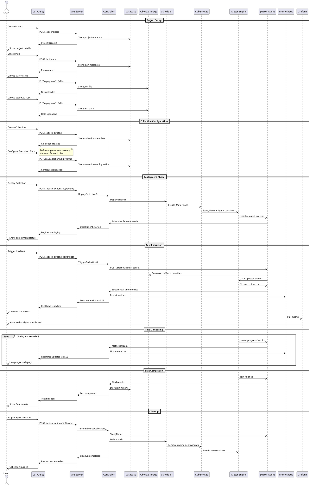

# Shibuya Load Testing Platform - Sequence Diagram

This sequence diagram shows the complete workflow of how Shibuya orchestrates load testing from project creation to test execution and results collection.

## PlantUML Sequence Diagram

## Key Components Interaction

### 1. Web Interface Layer
- **Vue.js UI**: Provides user-friendly interface for managing projects, collections, and plans
- **Real-time updates**: Uses Server-Sent Events (SSE) for live test monitoring

### 2. API Layer
- **REST API**: Handles CRUD operations for all entities
- **Authentication**: Integrates with LDAP for user permissions
- **File handling**: Manages upload/download of JMX files and test data

### 3. Orchestration Layer
- **Controller**: Central coordinator that manages engine lifecycle
- **Scheduler**: Abstracts Kubernetes/Cloud Run operations
- **Engine Management**: Tracks connected engines and their states

### 4. Execution Layer
- **JMeter Engines**: Run actual load tests in isolated containers
- **Shibuya Agent**: Sidecar process that manages JMeter and streams metrics
- **Kubernetes**: Provides scalable container orchestration

### 5. Data Layer
- **Database**: Stores metadata for projects, collections, plans, and runs
- **Object Storage**: Holds JMX files, test data, and artifacts
- **Prometheus**: Collects and stores real-time test metrics

## Workflow Phases

1. **Setup Phase**: Create organizational structure (projects) and test definitions (plans)
2. **Configuration Phase**: Group plans into collections with execution parameters
3. **Deployment Phase**: Provision JMeter engines in Kubernetes cluster
4. **Execution Phase**: Run distributed load tests with real-time monitoring
5. **Analysis Phase**: View results in Grafana dashboards and UI
6. **Cleanup Phase**: Terminate engines and free cluster resources

## Key Features

- **Distributed Testing**: Scales beyond single JMeter instance limitations
- **Real-time Monitoring**: Live metrics streaming during test execution
- **Resource Management**: Automatic provisioning and cleanup of test infrastructure
- **Multi-tenancy**: Project-based isolation with LDAP authentication
- **Cloud Native**: Designed for Kubernetes with support for multiple cloud providers